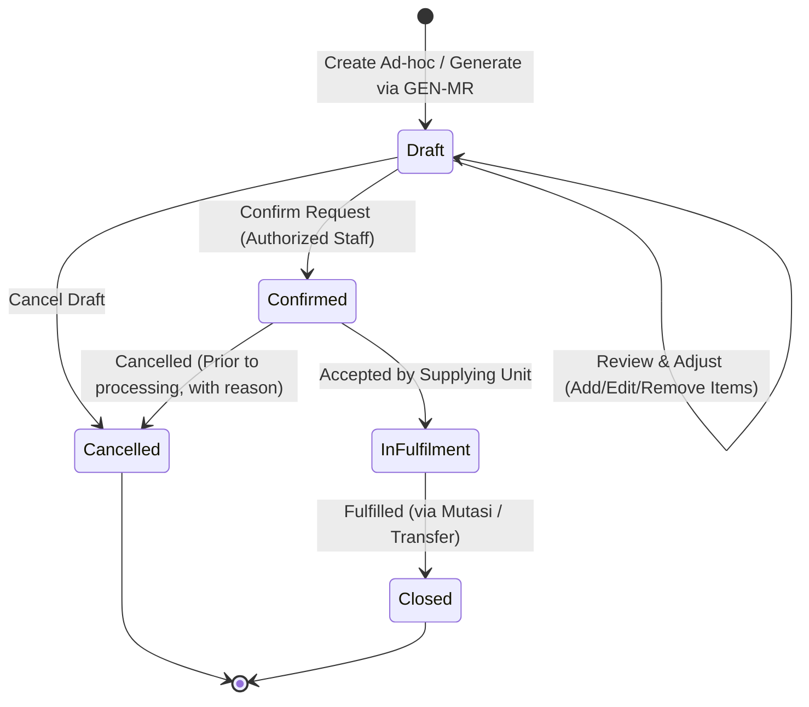

# OUTCOME: Material Request

| Field       | Value        |
|-------------|--------------|
| Code        | OC-13-01     |
| Version     | 1.0          |
| Status      | Draft        |
| LastUpdated | 2026-10-07   |

---

## 1. Business Purpose

Unit operasional dan unit pelayanan di rumah sakit (seperti Poliklinik Rawat Jalan, Bangsal Rawat Inap, IGD, Kamar Operasi, Laboratorium, Radiologi, dan Apotek/Depo) membutuhkan ketersediaan material yang berkesinambungan—baik obat-obatan, Bahan Medis Habis Pakai (BMHP), reagen, alkes habis pakai, maupun barang umum/logistik non-medis—untuk menyelenggarakan pelayanan kesehatan.

**Material Request** adalah mekanisme bisnis formal dan tercatat bagi unit peminta (*requesting unit*) untuk mengajukan kebutuhan material kepada unit penyedia (*supplying unit*, seperti Gudang Farmasi atau Gudang Logistik/Umum). Pengajuan dapat dibentuk melalui dua jalur:
1. **Perhitungan Otomatis Sistem (GEN-MR):** Sistem menghitung dan membentuk draf Material Request berdasarkan parameter persediaan (seperti stok minimum, stok maksimum, *reorder point*, dan konsumsi berjalan).
2. **Pengajuan Langsung (Manual / Ad-hoc):** Unit peminta menginput kebutuhan material secara langsung untuk kebutuhan mendesak, insidentil, atau kebutuhan di luar kalkulasi rutin persediaan.

Outcome ini menjamin bahwa seluruh kebutuhan material tercatat secara akuntabel, dapat ditinjau dan disesuaikan oleh unit peminta sebelum dikonfirmasi, serta menjadi dokumen permintaan resmi yang sah bagi unit penyedia tanpa mencampurkan fungsi alokasi stok, mutasi fisik barang, maupun pengadaan ke supplier eksternal.

---

## 2. Outcome Statement

Kebutuhan material dari unit peminta kepada unit penyedia **telah tercatat dan terkonfirmasi secara sah dalam dokumen Material Request—baik melalui pembuatan langsung maupun melalui draf kalkulasi GEN-MR yang telah ditinjau dan disesuaikan—serta siap diproses oleh unit penyedia untuk pemenuhan persediaan atau pengadaan lanjutan**.

---

## 3. Participating Domains

| Domain | Role in this Outcome |
|--------|----------------------|
| Purchasing | **Pemilik utama outcome**: mengelola siklus hidup pencatatan kebutuhan material (`PUR-MATREQ`), memelihara status dokumen (Draft, Confirmed, Cancelled, Closed), serta menyediakan keterlacakan riwayat permintaan untuk pemrosesan lebih lanjut. |
| Inventory | Menyediakan katalog master material yang sah (`INV-MASTER`), serta menyediakan data posisi stok dan parameter persediaan unit yang menjadi basis kalkulasi otomatis draf permintaan melalui mekanisme GEN-MR (`INV-STOK`). |
| Organisasi | Menyediakan master unit kerja rumah sakit sebagai unit peminta dan unit penyedia tujuan (`ORG-LAYANAN`), serta data tenaga terotorisasi yang membuat, meninjau, dan mengonfirmasi permintaan (`ORG-PPA`). |

---

## 4. Participating Capabilities

| Capability | Domain | Status |
|------------|--------|--------|
| `PUR-MATREQ` Material Request | Purchasing | Known |
| `INV-MASTER` Item Master | Inventory | Known |
| `INV-STOK` Stok | Inventory | Known |
| `ORG-LAYANAN` Unit Layanan | Organisasi | Known |
| `ORG-PPA` Petugas Pemberi Asuhan / Tenaga RS | Organisasi | Known |

> **Capability Status values:** Known · Existing but Undocumented · Capability Candidate

---

## 5. Outcome Specification

> What must be true for this Outcome to be considered established?

### 5.1 Required Business Facts

- **Identitas Dokumen Permintaan Unik:** Setiap Material Request memiliki nomor referensi/kode unik dokumen transaksi yang tercatat permanen di bawah kapabilitas `PUR-MATREQ`.
- **Relasi Peminta dan Penyedia yang Jelas:** Dokumen menghubungkan secara eksplisit unit kerja peminta (*requesting unit*) dengan unit kerja penyedia tujuan (*supplying unit*, misalnya Gudang Farmasi, Gudang Logistik/Umum, atau Depo Induk).
- **Dualitas Asal Pembentukan (Request Origin):**
  - *Sistem GEN-MR:* Sistem dapat mengumpulkan data parameter stok dan menghasilkan draf Material Request memuat material yang perlu diminta beserta kuantitas rekomendasi (*system-recommended quantity*).
  - *Manual / Ad-hoc:* Pengguna unit peminta dapat membuat Material Request secara mandiri tanpa melalui kalkulasi GEN-MR.
- **Kedaulatan Peninjauan Unit Peminta (Draft Review & Adjustment):** Draf Material Request (termasuk hasil GEN-MR) wajib dapat ditinjau oleh unit peminta. Unit peminta berwenang menambah item, mengubah kuantitas kebutuhan, atau menghapus item sebelum melakukan konfirmasi final.
- **Integritas Baris Permintaan (Request Lines):** Material Request memuat satu atau lebih baris item material yang terdaftar valid di `INV-MASTER` dengan kuantitas yang bernilai positif (> 0) dan satuan ukuran (*Unit of Measure / UOM*) yang sah.
- **Konfirmasi Sebagai Dokumen Resmi:** Material Request yang telah dikonfirmasi (*Confirmed*) berubah menjadi permintaan kebutuhan resmi dan mengikat kepada unit penyedia tujuan.
- **Pemisahan Kebutuhan dari Pemenuhan:** Material Request merepresentasikan fakta *kebutuhan material*, bukan persetujuan pengeluaran, bukan alokasi fisik stok di gudang, dan bukan pesanan pembelian ke pemasok luar (*Purchase Order*).
- **Keterlacakan Status & Riwayat (Audit Trail):** Dokumen memiliki status yang terdefinisi (*Draft*, *Confirmed*, *Cancelled*, *Closed*) serta riwayat perubahan yang dapat ditelusuri.

---

### 5.2 Required Recorded Information

**Header Permintaan (Request Header):**
- Nomor referensi transaksi Material Request (unik, diterbitkan sistem).
- Unit peminta (*requesting unit* / asal).
- Unit penyedia tujuan (*supplying unit* / tujuan).
- Tanggal dan waktu pengajuan / pembuatan draf.
- Tanggal kebutuhan yang diharapkan (*required date* / target pemenuhan).
- Asal pembentukan request (*Request Origin*: `GEN-MR` atau `Manual/Ad-hoc`).
- Status dokumen (`Draft`, `Confirmed`, `Cancelled`, `Closed`).
- Identitas pembuat (*Created By*: identitas staf unit peminta atau sistem GEN-MR).
- Identitas pengonfirmasi (*Confirmed By*: staf terotorisasi unit peminta) dan waktu konfirmasi (*Confirmed At*).
- Catatan / keterangan kebutuhan (*Header Remark / Justification*).

**Rincian Item Permintaan (Request Lines):**
- Nomor baris (*Line Number*).
- Kode dan nama material/barang (tervalidasi pada `INV-MASTER`).
- Satuan ukuran permintaan (*Requested Unit of Measure / UOM*).
- Kuantitas yang diminta (*Requested Quantity*).
- Kuantitas rekomendasi sistem (*Original GEN-MR Quantity*, khusus untuk dokumen yang berawal dari GEN-MR, tersimpan sebagai pembanding audit jika terjadi penyesuaian kuantitas).
- Catatan spesifik per baris item (*Line Remark*, opsional).

**Riwayat Status & Audit Trail:**
- Riwayat transisi status beserta stempel waktu dan pelaku perubahan.
- Alasan pembatalan (*Cancellation Reason*, wajib jika dibatalkan).

---

### 5.3 Required Business Conditions

- Unit peminta dan unit penyedia tujuan harus merupakan unit organisasi aktif dan valid dalam master unit layanan (`ORG-LAYANAN`).
- Unit peminta dan unit penyedia tidak boleh merupakan unit yang sama (*requesting unit ≠ supplying unit*).
- Unit penyedia tujuan harus memiliki otoritas pengelolaan atas jenis/kelompok material yang diminta (contoh: obat/alkes farmasi diajukan ke Gudang Farmasi, barang cetakan/ATK diajukan ke Gudang Logistik/Umum).
- Setiap item material yang dimasukkan harus berstatus aktif dalam master barang (`INV-MASTER`).
- Perhitungan GEN-MR wajib menggunakan parameter persediaan dan posisi stok unit peminta yang valid dari `INV-STOK`.
- Material Request harus memiliki minimal 1 (satu) baris item dengan kuantitas > 0 sebelum dapat dikonfirmasi.
- Penyesuaian isi request (tambah, ubah kuantitas, hapus item) hanya dapat dilakukan selama dokumen masih berstatus `Draft`.
- Konfirmasi permintaan hanya sah dilakukan oleh pengguna yang memiliki hak akses atau kewenangan di unit peminta (`ORG-PPA`).
- Dokumen yang telah berstatus `Confirmed` tidak dapat diubah kembali menjadi `Draft` atau diedit langsung oleh pengguna unit peminta.

---

### 5.4 Completion Proof

- Dokumen Material Request tersimpan secara persisten dengan nomor identifikasi unik di bawah kapabilitas `PUR-MATREQ`.
- Status dokumen tercatat sebagai **Confirmed**.
- Seluruh atribut wajib header dan minimal satu baris item material tersimpan lengkap dan valid.
- Data pengonfirmasi (*Confirmed By*) dan stempel waktu konfirmasi (*Confirmed At*) tercatat secara sah.
- Dokumen Material Request dapat diakses dan muncul dalam antrean kerja pemenuhan kebutuhan pada unit penyedia tujuan.

---

## 6. Outcome Boundary

### Start

- **Alur GEN-MR:** Dimulai ketika sistem (atau petugas yang memicu kalkulasi persediaan) menjalankan kalkulasi kebutuhan material berdasarkan parameter inventaris unit, dan menghasilkan draf Material Request.
- **Alur Manual / Ad-hoc:** Dimulai ketika petugas terotorisasi di unit peminta membuka formulir Material Request baru, memilih unit penyedia tujuan, dan menginputkan kebutuhan material.

### End

- Berakhir ketika dokumen Material Request berhasil dikonfirmasi (**Confirmed**) oleh unit peminta dan dipersistensikan sebagai permintaan resmi yang siap diproses oleh unit penyedia; ATAU
- Berakhir ketika draf Material Request dibatalkan (**Cancelled**) oleh unit peminta sebelum dikonfirmasi.

> **Batasan Penting:** Outcome ini berakhir pada penerbitan permintaan kebutuhan resmi yang terkonfirmasi. Penyiapan barang di gudang, pengeluaran barang, mutasi stok fisik, maupun pengadaan ke pemasok eksternal berada di luar batasan outcome ini.

---

## 7. Business Constraints

- **Kebutuhan Bukan Alokasi atau Pemenuhan (Request ≠ Allocation/Fulfilment):** Material Request merepresentasikan *kebutuhan material*, bukan jaminan ketersediaan stok fisik atau perintah pengeluaran barang. Keputusan pemenuhan berada pada unit penyedia.
- **Kedaulatan Konfirmasi Unit Peminta:** Draf yang dibentuk oleh kalkulasi GEN-MR tidak boleh langsung berstatus terkonfirmasi secara otomatis tanpa peninjauan dan konfirmasi eksplisit dari penanggung jawab unit peminta.
- **Integritas Master Material:** Setiap item material yang diminta wajib terdaftar dan aktif dalam master barang inventaris (`INV-MASTER`). Tidak diperkenankan memasukkan item teks bebas (*free-text*) tanpa kode katalog material.
- **Diferensiasi Unit Peminta dan Penyedia:** Unit peminta dilarang mengajukan Material Request kepada dirinya sendiri.
- **Imutabilitas Dokumen Terkonfirmasi:** Dokumen Material Request yang telah berstatus `Confirmed` terkunci dari pengeditan langsung (penambahan item, penghapusan item, atau pengubahan kuantitas).
- **Keterpisahan Finansial & PO Supplier:** Material Request tidak berhubungan langsung dengan pembuatan Purchase Order ke supplier eksternal (`PUR-PO`) dan tidak membentuk kewajiban utang/faktur (`PUR-FAKTUR`). Kebutuhan internal yang memerlukan pembelian eksternal harus diproses melalui mekanisme Purchase Request (`PUR-PURREQ`) di domain Purchasing.
- **Persistensi Jejak Rekomendasi GEN-MR:** Kuantitas rekomendasi awal dari GEN-MR harus tetap tersimpan sebagai jejak audit pembanding apabila pengguna unit peminta melakukan penyesuaian kuantitas saat peninjauan draf.

---

## 8. Business Exceptions

> Conditions under which the Outcome cannot be established or encounters an exception.

| Exception | Expected Behavior |
|-----------|-------------------|
| Item material yang diminta tidak aktif atau tidak ditemukan dalam master barang | Sistem menolak penambahan item; pengguna diminta memilih material yang valid dari `INV-MASTER`. |
| Kuantitas yang diminta bernilai nol (0) atau bernilai negatif | Sistem menolak penyimpanan atau konfirmasi baris item terkait. |
| Material Request diajukan untuk konfirmasi tanpa memuat baris item material sama sekali | Sistem menolak konfirmasi; minimal satu baris item material valid wajib tersedia. |
| Unit peminta dan unit penyedia yang dipilih identik | Sistem menolak pembentukan dokumen; unit peminta harus berbeda dari unit penyedia. |
| Material yang diminta tidak dikelola oleh unit penyedia tujuan (inkonsistensi kategori unit) | Sistem memberikan peringatan/penolakan dan mengarahkan pengguna memilih unit penyedia yang sesuai. |
| Parameter persediaan untuk kalkulasi GEN-MR belum dikonfigurasi pada unit peminta | Sistem mengabaikan item terkait dalam pembentukan GEN-MR dan memberikan notifikasi bahwa parameter stok belum ditentukan. |
| Pengguna tanpa hak otorisasi mencoba mengonfirmasi Material Request | Sistem menolak aksi konfirmasi; dokumen tetap berstatus `Draft` hingga disahkan oleh personel yang berwenang. |
| Upaya pengubahan item atau kuantitas pada Material Request yang telah berstatus `Confirmed` | Sistem menolak pengeditan langsung; perubahan hanya dapat ditempuh melalui pembatalan dokumen resmi (jika belum diproses penyedia) atau pembuatan request susulan. |
| Pembatalan diajukan atas Material Request yang telah selesai diproses oleh unit penyedia | Sistem menolak pembatalan dokumen; pengembalian barang fisik dialihkan ke mekanisme Retur Mutasi pada domain Inventory. |

---

## 9. Acceptance Criteria

> Verifiable criteria confirming the Outcome exists as specified.

| # | Criterion | Validates |
|---|-----------|-----------|
| AC-01 | Sistem berhasil mencatat Material Request yang memuat nomor referensi unik, unit peminta, unit penyedia, tanggal pengajuan, tanggal kebutuhan, dan sekurang-kurangnya 1 baris item material valid beserta kuantitas kebutuhan. | Completeness |
| AC-02 | Mekanisme GEN-MR berhasil membentuk draf Material Request berdasarkan kalkulasi posisi stok dan parameter persediaan unit peminta secara akurat. | Correctness |
| AC-03 | Pengguna di unit peminta dapat meninjau draf Material Request, menambah item material baru, mengubah kuantitas kebutuhan, dan menghapus item dari draf sebelum dikonfirmasi. | Completeness |
| AC-04 | Kuantitas rekomendasi awal hasil GEN-MR tetap tersimpan sebagai jejak audit ketika pengguna melakukan penyesuaian kuantitas pada draf. | Correctness |
| AC-05 | Unit peminta dapat membuat Material Request secara langsung (manual / ad-hoc) dengan memilih material dan kuantitas tanpa melalui proses kalkulasi GEN-MR. | Completeness |
| AC-06 | Konfirmasi Material Request berhasil mengubah status dokumen menjadi `Confirmed` serta merekam identitas pengonfirmasi dan stempel waktu konfirmasi secara permanen. | Completeness |
| AC-07 | Sistem menolak pengeditan baris item atau kuantitas pada Material Request yang telah berstatus `Confirmed`. | Constraint |
| AC-08 | Sistem menolak konfirmasi Material Request apabila tidak memuat baris item atau terdapat kuantitas item ≤ 0. | Constraint |
| AC-09 | Sistem menolak pembentukan Material Request apabila unit peminta identik dengan unit penyedia tujuan. | Constraint |
| AC-10 | Status dan riwayat dokumen Material Request dapat ditelusuri berdasarkan nomor request, unit peminta, unit penyedia, rentang tanggal, dan status dokumen. | Correctness |
| AC-11 | Pembentukan dan konfirmasi Material Request tidak memicu perubahan saldo fisik persediaan (`INV-STOK`) dan tidak menerbitkan Purchase Order kepada pemasok (`PUR-PO`). | Boundary |
| AC-12 | Hanya staf terotorisasi pada unit peminta yang dapat melakukan konfirmasi Material Request. | Constraint |

---

## 10. Out of Scope

> What this Outcome explicitly does NOT cover.

- **Penentuan Ketersediaan & Alokasi Stok Unit Penyedia:** Verifikasi ketersediaan fisik, reservasi stok (*stock reservation*), atau penentuan persetujuan pemenuhan penuh/sebagian oleh unit penyedia → Domain Inventory (`INV-STOK`, `INV-MUTASI`).
- **Penyiapan dan Pengemasan Barang (*Picking & Packing*):** Aktivitas fisik penyiapan barang di area gudang penyedia → Domain Gudang / Logistik (`SC-12 Gudang`).
- **Pengeluaran, Distribusi, dan Mutasi Stok Fisik:** Pencatatan transfer/mutasi keluar persediaan dan pemotongan saldo stok dari unit penyedia ke unit peminta → **OC-12-02 Mutasi Barang / SC-05-06 / SC-06-06 / SC-11-07** (`INV-MUTASI`).
- **Penerimaan Barang di Unit Peminta:** Konfirmasi penerimaan fisik barang dan penambahan saldo persediaan di unit peminta → Mutasi Masuk / Penerimaan Transfer (`INV-MUTASI`).
- **Pengadaan Eksternal ke Supplier:** Pengajuan pengadaan eksternal, pembuatan Purchase Order ke rekanan/supplier, dan negosiasi harga → **OC-13-03 Purchase Request** (`PUR-PURREQ`) dan **OC-13-04 Purchase Order** (`PUR-PO`).
- **Penerimaan Barang dari Supplier (DO) & Faktur Pembelian:** Penerimaan fisik barang dari supplier pihak ketiga dan pengakuan tagihan supplier → **OC-12-01 Terima Barang** (`PUR-DO`) dan **OC-13-05 Faktur Tagihan** (`PUR-FAKTUR`).
- **Peramalan Kebutuhan Makro Jangka Panjang (Hospital Forecasting):** Kalkulasi proyeksi kebutuhan pengadaan agregat rumah sakit → **OC-13-02 Forecasting**.

---

## 11. State Machine & Lifecycle

### Lifecycle State Definitions

| State | Definition | Permitted Actions |
|---|---|---|
| **Draft** | Dokumen kebutuhan telah dibentuk (melalui input manual ad-hoc atau mekanisme kalkulasi GEN-MR) namun belum resmi diajukan. | Tambah item, ubah kuantitas, hapus item, konfirmasi, batalkan draf. |
| **Confirmed** | Dokumen telah diverifikasi dan disahkan oleh unit peminta sebagai permintaan resmi kepada unit penyedia. | Ditinjau oleh unit penyedia, diproses pemenuhan, dibatalkan (hanya jika belum diproses). |
| **In Fulfilment** | Permintaan telah diterima dan sedang dalam tahap penyiapan/pemenuhan oleh unit penyedia (dikelola oleh alur pemenuhan/mutasi gudang). | Pemantauan progres pemenuhan oleh unit peminta. |
| **Closed** | Kebutuhan pada Material Request telah selesai dipenuhi (seluruh atau sebagian sesuai kesepakatan pemenuhan) atau ditutup secara resmi. | Penelusuran riwayat (*read-only*). |
| **Cancelled** | Permintaan dibatalkan sebelum diproses, disertai alasan pembatalan resmi. | Penelusuran riwayat (*read-only*). |

---

## 12. Participating Use Cases & Triggers

| Use Case ID | Use Case Name | Actor / Trigger | Description |
|---|---|---|---|
| **UC-13-01-01** | Generate Draft Material Request via GEN-MR | Sistem Persediaan / Staf Unit | Menghitung kebutuhan material berdasarkan parameter stok dan membentuk draf Material Request otomatis. |
| **UC-13-01-02** | Create Ad-hoc Material Request | Staf Unit Peminta | Menginput kebutuhan material secara langsung untuk kebutuhan mendesak atau insidentil. |
| **UC-13-01-03** | Review and Adjust Material Request Draft | Staf / Supervisor Unit Peminta | Meninjau item dan kuantitas pada draf, serta melakukan penyesuaian (tambah, ubah, hapus). |
| **UC-13-01-04** | Confirm Material Request | Staf Terotorisasi Unit Peminta | Mengonfirmasi draf Material Request menjadi dokumen permintaan resmi kepada unit penyedia. |
| **UC-13-01-05** | Cancel Material Request | Staf Terotorisasi Unit Peminta | Membatalkan draf atau dokumen terkonfirmasi yang belum diproses oleh unit penyedia. |
| **UC-13-01-06** | View Material Request History and Status | Staf Unit Peminta / Unit Penyedia | Menelusuri status terkini dan riwayat dokumen Material Request beserta rekam jejaknya. |
