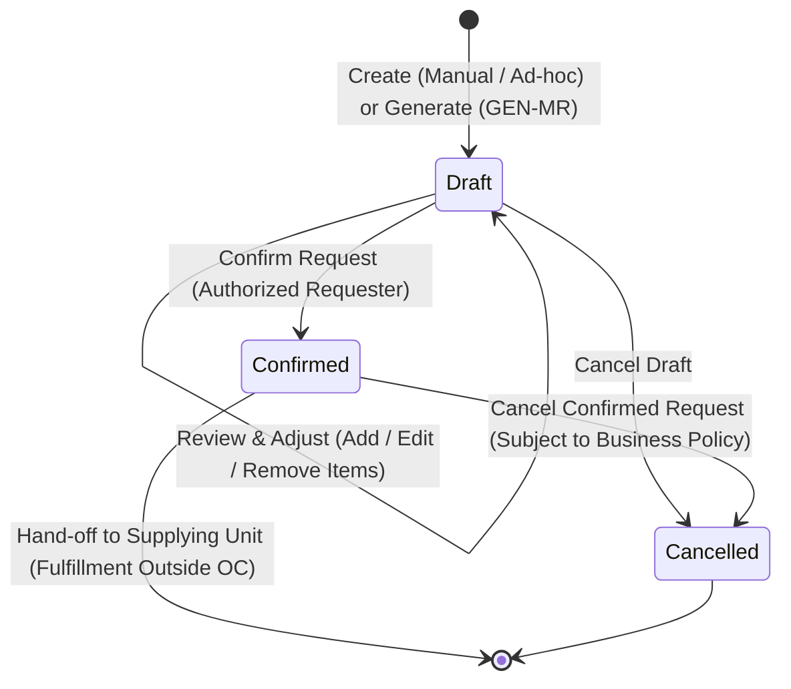

# OUTCOME: Material Request

| Field       | Value        |
|-------------|--------------|
| Code        | OC-13-01     |
| Version     | 1.1          |
| Status      | Review       |
| LastUpdated | 2026-10-07   |

---

## 1. Business Purpose

Setiap unit di rumah sakit—mencakup **unit pelayanan** (seperti Poliklinik Rawat Jalan, Bangsal Rawat Inap, IGD, Kamar Operasi, Laboratorium, Radiologi, dan Apotek), **unit operasional** (seperti CSSD, Laundry, Sanitasi, dan Pemeliharaan Sarana), maupun **unit administratif** (seperti Rekam Medis, Keuangan, Tata Usaha, dan Manajemen)—membutuhkan ketersediaan material yang dikelola oleh Inventory secara tepat dan berkesinambungan untuk mendukung operasional dan pelayanan rumah sakit.

**Material Request** adalah mekanisme bisnis formal dan tercatat bagi unit peminta (*requesting unit*) untuk menyatakan kebutuhan material kepada unit penyedia (*supplying unit*, seperti Gudang Farmasi, Gudang Logistik/Umum, atau Depo Utama). 

Secara esensial, Material Request merepresentasikan fakta kebutuhan:

> **"Unit membutuhkan material X sejumlah Y."**

Pengajuan kebutuhan ini dapat bersifat:
- **Kebutuhan Rutin / Periodik:** Pengajuan berkala yang terencana (misalnya permintaan bulanan atau mingguan).
- **Kebutuhan Ad-hoc / Insidentil:** Pengajuan langsung untuk kebutuhan mendesak, insidentil, atau kebutuhan di luar siklus rutin.

Untuk membentuk Material Request, sistem mendukung dua jalur pembentukan (*origin*):
1. **Perhitungan Otomatis Sistem (GEN-MR):** Sistem menghitung dan menghasilkan draf Material Request rekomendasi berdasarkan perhitungan kebutuhan persediaan (*inventory demand calculation*). Draf ini **bukan** permintaan yang langsung terkonfirmasi otomatis, melainkan rekomendasi yang wajib ditinjau oleh unit peminta.
2. **Pengajuan Langsung (Manual / Ad-hoc):** Pengguna di unit peminta membuat Material Request secara langsung tanpa melalui mekanisme kalkulasi GEN-MR.

Pada saat mengajukan permintaan, **unit peminta tidak perlu mengetahui atau mempertimbangkan posisi stok pada unit penyedia**. Kebutuhan yang dinyatakan murni merepresentasikan kebutuhan operasional unit peminta.

Outcome ini memastikan bahwa seluruh kebutuhan material internal tercatat, dapat ditinjau dan disesuaikan oleh unit peminta sebelum dikonfirmasi, serta menjadi dokumen permintaan resmi yang sah (**Confirmed Material Request**) bagi unit penyedia. Outcome ini **berakhir pada pembentukan permintaan resmi yang terkonfirmasi** dan secara tegas terpisah dari proses hilir (*downstream*) seperti alokasi stok, penyiapan barang (*picking/packing*), pengeluaran fisik (*issuing* / mutasi stok), maupun pengadaan ke supplier eksternal.

---

## 2. Outcome Statement

Kebutuhan material dari unit peminta kepada unit penyedia **telah tercatat dan terkonfirmasi secara sah dalam dokumen Material Request—baik melalui pembuatan langsung (rutin maupun ad-hoc) maupun melalui draf kalkulasi GEN-MR yang telah ditinjau dan disesuaikan—serta siap diserahkan (*hand-off*) dan diproses oleh unit penyedia**.

---

## 3. Participating Domains

| Domain | Role in this Outcome |
|--------|----------------------|
| Purchasing | **Pemilik utama outcome**: mengelola siklus hidup pencatatan kebutuhan material internal (`PUR-MATREQ`), memelihara status dokumen (`Draft`, `Confirmed`, `Cancelled`), serta menyediakan keterlacakan riwayat kebutuhan material yang siap diproses oleh unit penyedia. |
| Inventory | Menyediakan katalog master material yang sah (`INV-MASTER`), serta menyediakan data persediaan/kebutuhan unit peminta sebagai basis perhitungan pembentukan draf rekomendasi oleh mekanisme GEN-MR (`INV-STOK`). |
| Organisasi | Menyediakan master unit kerja rumah sakit—mencakup seluruh unit pelayanan, operasional, dan administratif—sebagai unit peminta maupun unit penyedia tujuan (`ORG-LAYANAN`), serta data tenaga terotorisasi yang membuat, meninjau, dan mengonfirmasi permintaan (`ORG-PPA`). |

---

## 4. Participating Capabilities

| Capability | Domain | Status |
|------------|--------|--------|
| `PUR-MATREQ` Material Request | Purchasing | Known |
| `INV-MASTER` Item Master | Inventory | Known |
| `INV-STOK` Stok | Inventory | Known |
| `ORG-LAYANAN` Unit Layanan | Organisasi | Known |
| `ORG-PPA` Petugas Pemberi Asuhan / Tenaga RS | Organisasi | Known |

> **Capability Status values:** Known · Existing but Undocumented · Capability Candidate

---

## 5. Outcome Specification

> What must be true for this Outcome to be considered established?

### 5.1 Required Business Facts

- **Identitas Dokumen Permintaan Unik:** Setiap Material Request memiliki nomor referensi/kode unik dokumen transaksi yang tercatat secara permanen di bawah kapabilitas `PUR-MATREQ`.
- **Cakupan Peminta Menyeluruh (Universal Requester):** Material Request dapat diajukan oleh seluruh unit di lingkungan rumah sakit tanpa terkecuali (unit pelayanan klinis, unit operasional penunjang, maupun unit administratif).
- **Cakupan Material Terkelola Inventory:** Material Request berlaku untuk semua jenis barang dan material yang dikelola dalam domain Inventory (baik medis maupun non-medis).
- **Independensi Kebutuhan terhadap Stok Penyedia:** Material Request merepresentasikan fakta kebutuhan unit peminta (*internal demand*). Unit peminta tidak disyaratkan untuk memeriksa atau mempertimbangkan ketersediaan stok pada unit penyedia saat menyusun request.
- **Dukungan Kebutuhan Rutin dan Ad-hoc:** Mendukung baik permintaan siklus berkala (rutin) maupun permintaan ad-hoc / insidentil.
- **Dua Asal Pembentukan yang Setara (Origin Dualism):**
  - *GEN-MR (System-Generated Draft):* Draf Material Request dihasilkan oleh sistem berdasarkan perhitungan kebutuhan persediaan untuk kemudian diserahkan kepada unit peminta untuk ditinjau.
  - *Manual / Ad-hoc:* Dibuat secara mandiri dan langsung oleh pengguna di unit peminta.
  Keduanya menghasilkan entitas dokumen yang sama: **Material Request**.
- **Kedaulatan Peninjauan Unit Peminta (Draft Review & Adjustment):** Draf yang dihasilkan melalui GEN-MR tidak pernah menjadi permintaan yang terkonfirmasi otomatis (*no automatic confirmation*). Unit peminta memiliki kewenangan penuh untuk:
  - meninjau (*review*) draf;
  - mengubah kuantitas (*adjust quantity*);
  - menambah item material baru;
  - menghapus item material dari draf;
  - kemudian mengonfirmasi (*confirm*) dokumen.
- **Pemisahan Tegas Kebutuhan dari Pemenuhan (Request ≠ Fulfillment):**
  - Material Request mencatat **Requested Quantity** (kuantitas yang dibutuhkan unit).
  - Proses pemenuhan downstream mencatat **Fulfilled Quantity** (kuantitas yang dipenuhi unit penyedia).
  - Perbedaan antara jumlah yang diminta dan jumlah yang akhirnya dipenuhi (misal: minta 100 pcs, dipenuhi 70 pcs) **tidak boleh mengubah** data kebutuhan awal (*Requested Quantity*) pada Material Request.
- **Konfirmasi Sebagai Permintaan Resmi:** Dokumen yang telah berstatus **Confirmed** menjadi permintaan resmi internal yang mengikat dan siap diproses oleh unit penyedia.
- **Keterlacakan Status & Audit Trail:** Dokumen memiliki status internal yang terdefinisi (`Draft`, `Confirmed`, `Cancelled`) beserta rekam jejak identitas pembuat, penyesuai, dan pengonfirmasi.

---

### 5.2 Required Recorded Information

**Header Permintaan (Request Header):**
- Nomor referensi transaksi Material Request (unik, diterbitkan sistem).
- Unit peminta (*requesting unit* / asal).
- Unit penyedia tujuan (*supplying unit* / tujuan).
- Tanggal dan waktu pengajuan / pembuatan draf.
- Tipe kebutuhan (*Routine/Periodic* atau *Ad-hoc*).
- Asal pembentukan request (*Request Origin*: `GEN-MR` atau `Manual/Ad-hoc`).
- Status dokumen (`Draft`, `Confirmed`, `Cancelled`).
- Identitas pembuat (*Created By*: user staf unit peminta atau sistem GEN-MR).
- Identitas pengonfirmasi (*Confirmed By*: staf terotorisasi unit peminta) dan waktu konfirmasi (*Confirmed At*).
- Catatan / keterangan kebutuhan (*Header Remark / Justification*, opsional).
- *Target Tanggal Kebutuhan (Required Date):* Informasi tanggal saat material diharapkan tiba (opsional / *open business decision*).

**Rincian Item Permintaan (Request Lines):**
- Nomor baris (*Line Number*).
- Kode dan nama material/barang (tervalidasi pada `INV-MASTER`).
- Satuan ukuran permintaan (*Requested Unit of Measure / UOM*).
- Kuantitas yang diminta (**Requested Quantity**).
- Kuantitas rekomendasi awal sistem (*Original GEN-MR Quantity*, khusus item hasil GEN-MR, tersimpan permanen sebagai jejak audit pembanding apabila terjadi penyesuaian).
- Catatan spesifik per baris item (*Line Remark*, opsional).

**Riwayat Status & Audit Trail:**
- Riwayat transisi status beserta stempel waktu dan pengguna terkait.
- Alasan pembatalan (*Cancellation Reason*, wajib jika dibatalkan).

---

### 5.3 Required Business Conditions

- Unit peminta dan unit penyedia tujuan terdaftar aktif dalam master unit layanan (`ORG-LAYANAN`).
- Setiap item material yang dicantumkan terdaftar aktif dalam master barang (`INV-MASTER`).
- Perhitungan GEN-MR menghasilkan rekomendasi berdasarkan kalkulasi data persediaan unit peminta (`INV-STOK`).
- Material Request harus memiliki minimal 1 (satu) baris item dengan kuantitas > 0 sebelum dapat dikonfirmasi.
- Penyesuaian isi request (tambah item, ubah kuantitas, hapus item) hanya dapat dilakukan selama dokumen masih berstatus `Draft`.
- Konfirmasi permintaan hanya sah dilakukan oleh personel yang memiliki kewenangan otorisasi pada unit peminta (`ORG-PPA`).
- Dokumen yang telah berstatus `Confirmed` terkunci dari pengeditan langsung baris item maupun kuantitas kebutuhan oleh unit peminta.

---

### 5.4 Completion Proof

Outcome ini dinyatakan selesai dan terbentuk secara sah apabila:

- Dokumen Material Request tersimpan secara persisten dengan nomor identifikasi unik di bawah kapabilitas `PUR-MATREQ`.
- Dokumen memuat unit peminta (*requester*) dan unit penyedia (*supplying unit*) yang sah.
- Dokumen memuat minimal 1 (satu) baris item material terdaftar beserta kuantitas kebutuhan (*Requested Quantity*).
- Status dokumen tercatat sebagai **Confirmed**.
- Identitas pengonfirmasi (*Confirmed By*) dan stempel waktu konfirmasi (*Confirmed At*) tercatat lengkap.
- Dokumen siap diakses dan diproses oleh unit penyedia tujuan (*ready for hand-off to supplying unit*).

> **Catatan Validasi Kunci:** Completion proof OC-13-01 **TIDAK** mensyaratkan pemenuhan barang fisik, alokasi stok, atau distribusi material telah selesai, karena pemenuhan berada di luar batasan outcome ini.

---

## 6. Outcome Boundary

### Start

- **Alur GEN-MR:** Dimulai ketika sistem menjalankan perhitungan kebutuhan persediaan unit dan menghasilkan draf Material Request rekomendasi.
- **Alur Manual / Ad-hoc:** Dimulai ketika pengguna di unit peminta membuka formulir Material Request baru, menentukan unit penyedia tujuan, dan menginputkan kebutuhan material (baik rutin maupun insidentil).

### End

- Berakhir ketika dokumen Material Request berhasil dikonfirmasi (**Confirmed**) oleh unit peminta dan siap diserahkan kepada unit penyedia (*hand-off to supplying unit*); ATAU
- Berakhir ketika dokumen Material Request dibatalkan (**Cancelled**) sesuai kebijakan pembatalan yang berlaku.

```text
┌─────────────────────────────────────────────────────────────┐
│                     OUTCOME OC-13-01                        │
│                                                             │
│  Inventory Data / Calculation                               │
│              ↓                                              │
│            GEN-MR ───────┐                                  │
│              ↓           │                                  │
│           MR Draft       │                                  │
│              ↓           │ (Manual / Ad-hoc)                │
│       Review & Adjust ◄──┘                                  │
│              ↓                                              │
│         Confirmed MR                                        │
└──────────────┬──────────────────────────────────────────────┘
               │ (Hand-off)
               ▼
┌─────────────────────────────────────────────────────────────┐
│                 OUTSIDE OC-13-01 (DOWNSTREAM)               │
│                                                             │
│         Supplying Unit Fulfillment Process                  │
│  (Allocation, Picking, Issuing, Mutation, Distribution)     │
└─────────────────────────────────────────────────────────────┘
```

> **Batasan Penting:** Outcome ini berakhir pada terbitnya permintaan material resmi yang terkonfirmasi (*confirmed internal material demand*). Seluruh proses hilir seperti penentuan alokasi stok, penyiapan barang fisik (*picking/packing*), pengeluaran/distribusi barang, pencatatan mutasi stok fisik, maupun pembelian ke supplier eksternal berada di luar batasan OC-13-01.

---

## 7. Business Constraints

- **Material Request Merepresentasikan Kebutuhan, Bukan Pemenuhan (Demand ≠ Fulfillment):** Material Request mendokumentasikan apa yang dibutuhkan unit peminta, bukan keputusan alokasi atau kemampuan pemenuhan unit penyedia.
- **Independensi Evaluasi Stok Penyedia:** Unit peminta tidak dibebani kewajiban untuk memeriksa saldo persediaan unit penyedia saat mengajukan permintaan.
- **Kedaulatan Keputusan Unit Peminta Atas Draf GEN-MR:** Draf hasil perhitungan GEN-MR dilarang terkonfirmasi secara otomatis tanpa peninjauan dan konfirmasi eksplisit dari penanggung jawab unit peminta.
- **Parameter GEN-MR Sebagai Business Rules:** Parameter perhitungan (seperti konsumsi historis, stok minimum/maksimum, atau titik pemesanan ulang) merupakan aturan bisnis kalkulasi GEN-MR dan tidak mengunci spesifikasi inti outcome Material Request.
- **Pemisahan Data Permintaan dan Data Pemenuhan:** Nilai `Requested Quantity` bersifat permanen dan tidak boleh disesuaikan atau dikurangi ketika `Fulfilled Quantity` dari unit penyedia berjumlah lebih sedikit.
- **Integritas Master Material:** Semua item yang diminta wajib terdaftar aktif dalam katalog `INV-MASTER`.
- **Cakupan Universal Seluruh Unit:** Akses pembuatan Material Request terbuka bagi semua unit rumah sakit (pelayanan, operasional, administratif).
- **Imutabilitas Dokumen Terkonfirmasi:** Dokumen yang telah berstatus `Confirmed` tidak dapat diedit secara langsung (item dan kuantitas terkunci).
- **Keterpisahan Finansial & Pembelian Luar:** Material Request adalah dokumen kebutuhan internal dan tidak berhubungan langsung dengan pembuatan Purchase Order ke supplier eksternal (`PUR-PO`) maupun pengakuan hutang/faktur (`PUR-FAKTUR`). Kebutuhan yang memerlukan pembelian luar diproses melalui alur Purchase Request (`PUR-PURREQ`) di domain Purchasing.

---

## 8. Business Exceptions

> Conditions under which the Outcome cannot be established or encounters an exception.

| Exception | Expected Behavior |
|-----------|-------------------|
| Item material yang diminta tidak aktif atau tidak ditemukan dalam master barang | Sistem menolak penambahan item; pengguna diminta memilih material yang valid dari `INV-MASTER`. |
| Kuantitas yang diminta bernilai nol (0) atau negatif | Sistem menolak penyimpanan atau konfirmasi baris item terkait. |
| Material Request diajukan untuk konfirmasi tanpa memuat satu pun baris item | Sistem menolak konfirmasi; minimal satu baris item material valid wajib tersedia. |
| Data perhitungan kebutuhan persediaan untuk GEN-MR tidak tersedia atau belum memadai | Sistem tidak dapat menghasilkan draf GEN-MR untuk item terkait; unit peminta dapat menggunakan jalur pembuatan Manual / Ad-hoc. |
| Pengguna tanpa hak otorisasi mencoba mengonfirmasi Material Request | Sistem menolak aksi konfirmasi; dokumen tetap berstatus `Draft` hingga disahkan oleh personel yang berwenang. |
| Upaya pengubahan item atau kuantitas pada Material Request yang telah berstatus `Confirmed` | Sistem menolak pengeditan langsung; perubahan kebutuhan harus dituangkan melalui request baru atau pembatalan dokumen resmi. |
| Pembatalan diajukan atas dokumen yang telah `Confirmed` | Mengikuti kebijakan bisnis rumah sakit: diperbolehkan jika unit penyedia belum memulai pemrosesan/penyiapan barang; ditolak jika downstream pemenuhan telah berjalan. |

---

## 9. Acceptance Criteria

> Verifiable criteria confirming the Outcome exists as specified.

| # | Criterion | Validates |
|---|-----------|-----------|
| AC-01 | Sistem berhasil mencatat Material Request yang memuat nomor referensi unik, unit peminta (pelayanan, operasional, atau administratif), unit penyedia, dan sekurang-kurangnya 1 baris item material valid beserta kuantitas kebutuhannya (*Requested Quantity*). | Completeness |
| AC-02 | Mekanisme GEN-MR berhasil membentuk draf Material Request rekomendasi berdasarkan perhitungan kebutuhan persediaan. | Correctness |
| AC-03 | Pengguna di unit peminta dapat meninjau draf Material Request, menambah item material baru, mengubah kuantitas kebutuhan, dan menghapus item dari draf sebelum dikonfirmasi. | Completeness |
| AC-04 | Kuantitas rekomendasi awal dari GEN-MR tetap tersimpan sebagai jejak audit pembanding saat pengguna melakukan penyesuaian kuantitas pada draf. | Correctness |
| AC-05 | Unit peminta dapat membuat Material Request secara langsung (manual / ad-hoc, baik rutin maupun insidentil) tanpa bergantung pada kalkulasi GEN-MR. | Completeness |
| AC-06 | Konfirmasi Material Request berhasil mengubah status dokumen menjadi `Confirmed` serta mencatat identitas pengonfirmasi dan stempel waktu konfirmasi secara permanen. | Completeness |
| AC-07 | Dokumen Material Request yang telah `Confirmed` mengunci nilai `Requested Quantity` sehingga tidak terubah oleh kuantitas pemenuhan fisik downstream. | Constraint |
| AC-08 | Sistem menolak konfirmasi Material Request apabila tidak memuat baris item atau terdapat kuantitas item ≤ 0. | Constraint |
| AC-09 | Status dan riwayat dokumen Material Request dapat ditelusuri oleh unit peminta maupun unit penyedia berdasarkan nomor dokumen, unit, tanggal, dan status. | Correctness |
| AC-10 | Pembentukan dan konfirmasi Material Request tidak memicu perubahan saldo fisik persediaan (`INV-STOK`) dan tidak otomatis menghasilkan Purchase Order ke supplier (`PUR-PO`). | Boundary |
| AC-11 | Hanya personel dengan kewenangan otorisasi pada unit peminta yang dapat melakukan aksi konfirmasi pada Material Request. | Constraint |
| AC-12 | Kriteria keberhasilan outcome ini tidak mensyaratkan penyelesaian pemenuhan fisik, alokasi stok, atau distribusi barang oleh unit penyedia. | Boundary |

---

## 10. Out of Scope

> What this Outcome explicitly does NOT cover.

- **Penentuan Ketersediaan & Alokasi Stok Unit Penyedia:** Pengecekan saldo fisik, reservasi stok (*stock reservation*), atau penentuan kuantitas yang dapat disetujui oleh unit penyedia → Domain Inventory (`INV-STOK`, `INV-MUTASI`).
- **Penyiapan dan Pengemasan Barang Fisik (*Picking & Packing*):** Aktivitas operasional penyiapan fisik barang di area penyimpanan/gudang → Domain Gudang / Logistik (`SC-12 Gudang`).
- **Pengeluaran, Distribusi, dan Mutasi Stok Fisik:** Pencatatan transfer/mutasi keluar persediaan dan pemotongan saldo stok dari unit penyedia ke unit peminta → **OC-12-02 Mutasi Barang / SC-05-06 / SC-06-06 / SC-11-07** (`INV-MUTASI`).
- **Penerimaan Fisik Barang di Unit Peminta:** Verifikasi fisik barang yang diterima di unit peminta dan penambahan saldo persediaan unit peminta → Mutasi Masuk / Terima Transfer (`INV-MUTASI`).
- **Pengadaan Eksternal ke Supplier:** Pengajuan pengadaan eksternal, pembuatan Purchase Order ke rekanan/supplier, dan negosiasi harga → **OC-13-03 Purchase Request** (`PUR-PURREQ`) dan **OC-13-04 Purchase Order** (`PUR-PO`).
- **Penerimaan Barang dari Supplier (DO) & Faktur Pembelian:** Penerimaan kiriman supplier dan penagihan hutang → **OC-12-01 Terima Barang** (`PUR-DO`) dan **OC-13-05 Faktur Tagihan** (`PUR-FAKTUR`).
- **Eksekusi dan Kepemilikan Alur Fulfillment:** Seluruh siklus pemenuhan fisik barang merupakan proses hilir yang berada di luar batasan internal Material Request.

---

## 11. State Machine & Lifecycle

State machine internal Material Request pada OC-13-01 berfokus secara ketat pada siklus hidup pembentukan dan konfirmasi permintaan:



### Lifecycle State Definitions

| State | Definition | Permitted Actions |
|---|---|---|
| **Draft** | Dokumen kebutuhan telah dibentuk (melalui kalkulasi GEN-MR atau input manual ad-hoc) namun belum diajukan secara resmi. | Meninjau draf, menambah item, mengubah kuantitas kebutuhan, menghapus item, mengonfirmasi request, membatalkan draf. |
| **Confirmed** | Dokumen telah diverifikasi dan disahkan oleh unit peminta sebagai permintaan resmi internal yang siap diproses oleh unit penyedia (*hand-off*). Ini merupakan status akhir keberhasilan outcome OC-13-01. | Ditinjau oleh unit penyedia, diserahkan ke alur downstream pemenuhan, dibatalkan (hanya jika diizinkan kebijakan bisnis dan belum diproses). |
| **Cancelled** | Permintaan dibatalkan sebelum diproses, disertai pencatatan alasan pembatalan resmi. | Penelusuran riwayat (*read-only*). |

### Pemisahan Visibilitas vs Kepemilikan Pemenuhan

> [!IMPORTANT]
> **Visibility of Fulfillment Status ≠ Ownership of Fulfillment.**
> 
> Sistem antarmuka dapat menampilkan indikator status pemenuhan hilir (*downstream fulfillment status*, misalnya: *Pending Fulfillment*, *Partially Fulfilled*, *Fully Fulfilled*) kepada unit peminta untuk kebutuhan pemantauan. Namun, status-status tersebut **bukan merupakan state internal dari Material Request** dan sepenuhnya dimiliki oleh alur kerja unit penyedia / mutasi gudang. Outcome OC-13-01 tidak memiliki maupun mengelola state pemenuhan fisik tersebut.

---

## 12. Participating Use Cases & Triggers

| Use Case ID | Use Case Name | Actor / Trigger | Description |
|---|---|---|---|
| **UC-13-01-01** | Generate Draft Material Request via GEN-MR | Sistem Persediaan / Staf Unit | Menghitung kebutuhan material berdasarkan kalkulasi persediaan unit dan membentuk draf Material Request rekomendasi. |
| **UC-13-01-02** | Create Manual / Ad-hoc Material Request | Staf Unit Peminta | Menginput kebutuhan material secara langsung untuk kebutuhan rutin maupun insidentil. |
| **UC-13-01-03** | Review and Adjust Material Request Draft | Staf / Supervisor Unit Peminta | Meninjau isi draf, mengubah kuantitas kebutuhan, menambah material baru, atau menghapus baris item. |
| **UC-13-01-04** | Confirm Material Request | Staf Terotorisasi Unit Peminta | Mengesahkan draf Material Request menjadi dokumen permintaan resmi kepada unit penyedia. |
| **UC-13-01-05** | Cancel Material Request | Staf Terotorisasi Unit Peminta | Membatalkan draf atau dokumen terkonfirmasi sesuai batasan kebijakan bisnis rumah sakit. |
| **UC-13-01-06** | View Material Request History and Status | Staf Unit Peminta / Unit Penyedia | Menelusuri status dan riwayat dokumen Material Request beserta rekam jejak auditnya. |

---

## 13. Open Business Decisions

Berikut adalah poin-poin keputusan bisnis yang memerlukan validasi lebih lanjut bersama tim bisnis / arsitektur:

1. **Kebijakan Pembatalan Pasca-Confirmed:** Batasan pasti kapan pembatalan atas Material Request yang sudah `Confirmed` masih diperbolehkan (misalnya: apakah dibatasi secara ketat sebelum unit penyedia memulai proses penyiapan/alokasi barang).
2. **Status Atribut `Required Date`:** Apakah tanggal target kebutuhan (*required date*) bersifat wajib (*mandatory*) diisi saat pembuatan request atau bersifat opsional (*optional field*).
3. **Validasi Unit Peminta dan Penyedia:** Konfirmasi apakah terdapat skenario operasional tertentu di mana unit diperbolehkan meminta kepada unit yang sama (misalnya sub-depo internal) atau apakah validasi *requester ≠ supplier* berlaku mutlak.
4. **Model Wewenang Otorisasi Konfirmasi:** Penentuan matriks kewenangan konfirmasi (apakah cukup staf ruangan/kepala ruangan atau memerlukan level supervisor/manajer tertentu berdasarkan nilai atau jenis material).
