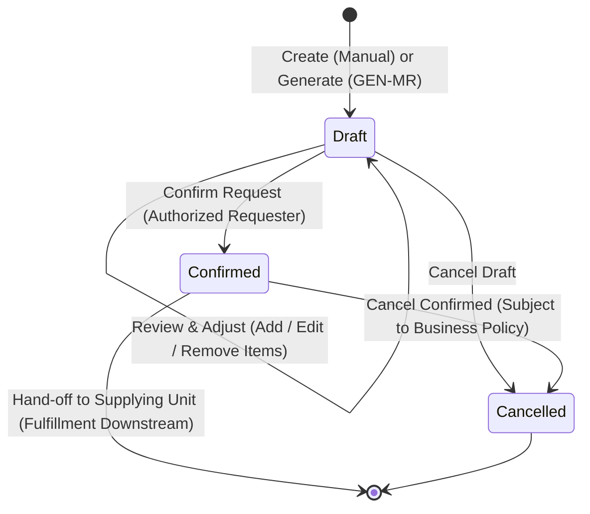

# OUTCOME: Material Request

| Field       | Value        |
|-------------|--------------|
| Code        | OC-13-01     |
| Version     | 1.2          |
| Status      | Review       |
| LastUpdated | 2026-10-09   |

---

## 1. Business Purpose & Statement

**Material Request** merepresentasikan pencatatan fakta kebutuhan internal rumah sakit:
> *"Unit Peminta membutuhkan material X sejumlah Y kepada Unit Penyedia."*

Outcome ini memastikan kebutuhan material dari unit peminta (pelayanan, operasional, atau administratif) **telah tercatat dan terkonfirmasi secara sah dalam dokumen Material Request—baik melalui pembuatan manual/ad-hoc maupun draf kalkulasi persediaan (GEN-MR) yang telah ditinjau dan disesuaikan—serta siap diserahterimakan (*hand-off*) kepada unit penyedia.**

Outcome ini **berakhir pada pembentukan permintaan resmi yang terkonfirmasi (`Confirmed`)** dan terpisah secara tegas dari alur pemenuhan fisik downstream (alokasi stok, picking, mutasi keluar, pengadaan supplier).

---

## 2. Participating Domains & Capabilities

| Domain | Capability | Role in this Outcome |
|--------|------------|----------------------|
| **Purchasing** | `PUR-MATREQ` | **Pemilik Outcome**: Mengelola siklus hidup dokumen permintaan material (`Draft`, `Confirmed`, `Cancelled`) dan riwayat kebutuhan internal. |
| **Inventory** | `INV-MASTER` `INV-STOK` | Menyediakan katalog master material aktif serta data persediaan unit sebagai basis perhitungan draf rekomendasi GEN-MR. |
| **Organisasi** | `ORG-LAYANAN` `ORG-PPA` | Menyediakan master unit kerja (unit peminta & unit penyedia) dan data tenaga terotorisasi pengonfirmasi. |

---

## 3. Core Business Rules & Invariants

1. **Origin Dualism:** Request dapat dibentuk melalui dua jalur yang setara:
   - **GEN-MR (System-Generated):** Draf rekomendasi otomatis berbasis kalkulasi kebutuhan persediaan.
   - **Manual / Ad-hoc:** Pengajuan langsung oleh staf unit peminta untuk kebutuhan rutin maupun insidentil.
2. **Review Sovereignty (Kedaulatan Unit Peminta):** Draf GEN-MR tidak boleh terkonfirmasi otomatis. Unit peminta memiliki kewenangan penuh untuk meninjau, mengubah kuantitas, menambah, atau menghapus item sebelum konfirmasi.
3. **Pemisahan Kebutuhan vs Pemenuhan (*Demand ≠ Fulfillment*):**
   - `Requested Quantity` mencatat kebutuhan murni unit peminta dan tidak bergantung pada posisi stok unit penyedia.
   - Nilai `Requested Quantity` bersifat permanen dan tidak boleh berubah meskipun kuantitas yang dipenuhi (*Fulfilled Quantity*) di alur gudang berbeda.
4. **Imutabilitas Dokumen Terkonfirmasi:** Dokumen yang telah berstatus `Confirmed` terkunci dari pengeditan langsung baris item maupun kuantitas.
5. **Universal Requester:** Berlaku untuk seluruh unit RS dan seluruh item aktif dalam master inventori.
6. **Validasi Dokumen:** Dokumen wajib memuat minimal 1 baris item valid dengan kuantitas > 0 dan disahkan oleh pengguna terotorisasi (`ORG-PPA`).

---

## 4. Required Recorded Information

- **Header Permintaan:**
  - Nomor referensi transaksi (unik).
  - Unit Peminta (*Requesting Unit*) & Unit Penyedia Tujuan (*Supplying Unit*).
  - Tipe Kebutuhan (*Routine* / *Ad-hoc*) & Asal Pembentukan (`GEN-MR` / `Manual`).
  - Status Dokumen (`Draft`, `Confirmed`, `Cancelled`).
  - Identitas Pembuat (`Created By`, `Created At`).
  - Identitas Pengonfirmasi (`Confirmed By`, `Confirmed At`).
  - Target Tanggal Kebutuhan (*Required Date*, opsional) & Catatan (*Remarks*, opsional).
- **Rincian Item (Lines):**
  - Kode & Nama Material (tervalidasi pada `INV-MASTER`).
  - Satuan Ukuran Permintaan (*Requested UOM*).
  - Kuantitas Diminta (**Requested Quantity**).
  - Kuantitas Rekomendasi Awal Sistem (*Original GEN-MR Qty*, jejak audit pembanding jika ada penyesuaian).
  - Catatan Item (*Line Remarks*, opsional).
- **Audit & Pembatalan:**
  - Riwayat transisi status, stempel waktu, user, dan Alasan Pembatalan (*Cancellation Reason* jika dibatalkan).

---

## 5. Lifecycle & State Machine

| State | Keterangan & Aksi yang Diizinkan |
|---|---|
| **Draft** | Draf kebutuhan tersusun; bebas menambah/mengubah kuantitas/menghapus item, mengonfirmasi, atau membatalkan. |
| **Confirmed** | Permintaan resmi disahkan dan terkunci; siap diserahkan (*hand-off*) ke alur pemrosesan unit penyedia. |
| **Cancelled** | Permintaan dibatalkan dengan pencatatan alasan resmi (*read-only*). |

> *Catatan:* Status pemenuhan gudang (misal: *Pending Fulfillment*, *Partially Fulfilled*, *Fully Fulfilled*) merupakan visibilitas operasional hilir dan bukan bagian dari state internal Material Request.

---

## 6. Boundary & Out of Scope

| In Scope (OC-13-01) | Out of Scope (Domain / Outcome Lain) |
|---|---|
| Pembentukan draf via GEN-MR atau input manual | Pengecekan saldo fisik & alokasi stok penyedia (`INV-STOK`) |
| Peninjauan, penyesuaian, dan konfirmasi kebutuhan unit | Penyiapan fisik barang, picking & packing di gudang (`SC-12`) |
| Pencatatan resmi kuantitas kebutuhan (*Requested Qty*) | Pengeluaran, mutasi stok fisik, & terima barang (`OC-12-02`, `INV-MUTASI`) |
| Serah terima dokumen terkonfirmasi ke unit penyedia | Pengadaan eksternal, Purchase Request & Purchase Order (`OC-13-03`, `OC-13-04`) |

---

## 7. Acceptance Criteria

| # | Kriteria Keberhasilan | Validasi |
|---|---|---|
| **AC-01** | Sistem berhasil mencatat Material Request dengan nomor unik, unit peminta, unit penyedia, dan minimal 1 item valid dengan `Requested Quantity` > 0. | Kelengkapan |
| **AC-02** | Mekanisme GEN-MR berhasil membentuk draf rekomendasi berbasis kalkulasi kebutuhan persediaan tanpa terkonfirmasi otomatis. | Ketepatan |
| **AC-03** | Pengguna unit peminta dapat meninjau draf, mengubah kuantitas, menambah/menghapus item, dengan nilai rekomendasi awal GEN-MR tetap tersimpan sebagai jejak audit. | Fungsional |
| **AC-04** | Pengguna dapat membuat Material Request secara manual/ad-hoc langsung tanpa bergantung pada GEN-MR. | Fungsional |
| **AC-05** | Aksi konfirmasi oleh staf terotorisasi mengubah status menjadi `Confirmed`, mengunci data permintaan, dan mencatat identitas serta waktu konfirmasi. | Otorisasi & Integritas |
| **AC-06** | Pembentukan dan konfirmasi Material Request tidak memicu pemotongan saldo stok fisik (`INV-STOK`) maupun pembuatan PO supplier (`PUR-PO`). | Batasan (*Boundary*) |
| **AC-07** | Dokumen Material Request dan riwayat statusnya dapat ditelusuri oleh unit peminta maupun unit penyedia tujuan. | Keterlacakan |

---

## 8. Open Business Decisions

1. **Kebijakan Pembatalan Pasca-Confirmed:** Batas waktu/tahapan pemrosesan gudang di mana Material Request `Confirmed` masih dapat dibatalkan.
2. **Kewajiban Target Tanggal (`Required Date`):** Penentuan apakah tanggal target kebutuhan bersifat wajib (*mandatory*) atau opsional.
3. **Matriks Otorisasi Konfirmasi:** Konfirmasi apakah persetujuan cukup di tingkat staf/kepala ruangan atau bertingkat berdasarkan jenis/nilai material.
