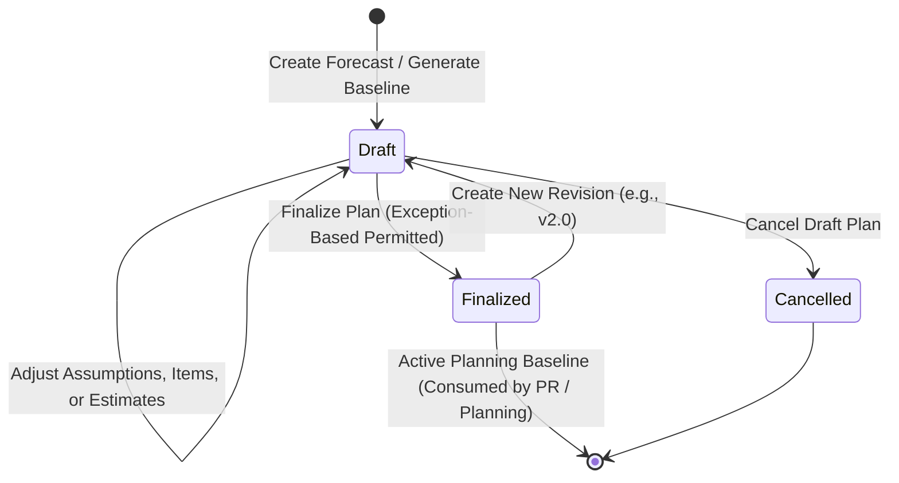

# OUTCOME: Forecasting

| Field       | Value        |
|-------------|--------------|
| Code        | OC-13-02     |
| Version     | 1.1          |
| Status      | Review       |
| LastUpdated | 2026-10-10   |

---

## 1. Business Purpose & Statement

**Forecasting** merepresentasikan pencatatan fakta rencana proyeksi kebutuhan dan rekomendasi pengadaan material rumah sakit untuk suatu horizon periode tertentu:
> *"Rumah Sakit memproyeksikan kebutuhan konsumsi material X sebesar A dan merekomendasikan pengadaan sebesar B untuk periode perencanaan T."*

Outcome ini memastikan dokumen perencanaan **Forecasting Kebutuhan Material (*Material Demand Forecast & Procurement Recommendation Plan*)** untuk suatu horizon periode **telah terbentuk, diverifikasi kelayakan kalkulasinya, dan difinalisasi sebagai rekaman persisten (*persisted snapshot*)—memuat proyeksi kebutuhan (*Demand Forecast*) serta rekomendasi kuantitas pengadaan (*Procurement Recommendation*) per material aktif beserta penandaan status kelayakan/pengecualian secara transparan—siap dijadikan acuan resmi perencanaan pengadaan rumah sakit.**

Dokumen Forecasting berfungsi murni sebagai **acuan perencanaan (*planning baseline*)** dan terpisah secara tegas dari transaksi pemesanan fisik/komersial (Purchase Request, Purchase Order, mutasi persediaan, maupun utang usaha).

---

## 2. Participating Domains & Capabilities

| Domain | Capability | Role in this Outcome |
|--------|------------|----------------------|
| **Purchasing** | `PUR-FORECAST`*(Candidate)* `PUR-MATREQ` `PUR-PURREQ` | **Pemilik Outcome**: Mengelola horizon perencanaan, mengonsumsi data permintaan unit, menghasilkan kalkulasi proyeksi & rekomendasi, mengelola siklus dokumen (`Draft`, `Finalized`, `Cancelled`), serta menyediakan baseline bagi pengajuan lanjutan (`PUR-PURREQ`). |
| **Inventory** | `INV-MASTER` `INV-STOK` `INV-PAKAI` `INV-MUTASI` | Menyediakan katalog item aktif, posisi stok efektif/teralokasi, riwayat konsumsi operasional riil, serta parameter persediaan (*safety stock*, *lead time*). |
| **Organisasi** | `ORG-LAYANAN` `ORG-PPA` | Menyediakan struktur unit pelayanan/depo/gudang dan data otoritas perencana/penyetuju dokumen. |
| **Layanan Klinis & Penunjang** | *RJL, RNA, IGD, LAB, RAD, KMO, APT* | Menyediakan tren volume aktivitas operasional sebagai faktor pendorong (*demand drivers*) kebutuhan material. |

> *Catatan Tata Kelola:* Kapabilitas `PUR-FORECAST` berstatus *Capability Candidate* hingga siklus pembaruan formal `DOMAIN-CATALOG.md`.

---

## 3. Core Business Rules & Invariants

1. **Hakikat Dokumen Perencanaan (Persisted Snapshot):** Dokumen final merupakan rekaman snapshot persisten (*immutable*). Perubahan data konsumsi/stok real-time di kemudian hari tidak mengubah isi dokumen yang telah `Finalized`.
2. **Dua Pilar Analisis Per Material:** Setiap baris material aktif wajib menyajikan dua hasil analitis independen:
   - *Demand Forecast Quantity*: proyeksi kebutuhan konsumsi periode horizon.
   - *Procurement Recommendation Quantity*: estimasi kebutuhan pengadaan baru ($\ge 0$).
3. **Pemisahan Mutasi vs Konsumsi Riil:** Data mutasi antar-lokasi persediaan (`INV-MUTASI`) dilarang dihitung sebagai konsumsi baru. Konsumsi hanya diakui dari pemakaian nyata di unit pelayanan (`INV-PAKAI`).
4. **Anti-Double Counting (Pencegahan Perhitungan Ganda):**
   - Permintaan unit tertunda (*Outstanding Material Request*) hanya diperhitungkan jika terbukti belum tercakup dalam rata-rata proyeksi konsumsi dan belum dialokasikan stok fisiknya.
   - Kebutuhan selama *lead time* diperhitungkan eksplisit, namun dilarang ditambahkan ulang bila rentang lead time telah tercakup dalam horizon forecast yang sama.
   - Pasokan masuk berjalan (*on-order PO*) dan stok teralokasi diperhitungkan secara konsisten terhadap saldo stok efektif.
5. **Non-Negatif Rekomendasi (Surplus Handling):** Jika stok efektif dan pasokan masuk melampaui kebutuhan periode, rekomendasi pengadaan ditetapkan bernilai nol (`0`).
6. **Perlakuan Material Tanpa Histori:** Ketiadaan riwayat konsumsi tidak boleh otomatis menghasilkan nilai forecast nol (`0`). Material ditangani via estimasi analogi sejenis, estimasi manual berjustifikasi, atau ditandai sebagai `Exception / Insufficient Basis`.
7. **Isolasi Data Estimasi:** Nilai estimasi manual atau analogi disimpan terisolasi pada dokumen perencanaan dan dilarang mencemari database histori transaksi inventori.
8. **Exception-Based Finalization:** Dokumen dapat difinalisasi kendati memuat item `Exception / Insufficient Basis`, dengan ketentuan item tersebut ditandai eksplisit dan kuantitasnya tidak sah dikonsumsi sebagai rekomendasi pengadaan otomatis.
9. **Pemisahan Status Dokumen vs Status Item:**
   - Status Dokumen: `Draft`, `Finalized`, `Cancelled`.
   - Status Item: `Valid Recommendation`, `Exception / Insufficient Basis`.
10. **Revisi Dokumen (Versioning):** Penyesuaian atas dokumen `Finalized` dilakukan melalui penerbitan revisi baru (misal V1.0 $\rightarrow$ V2.0 bertatus `Draft`). Dokumen `Finalized` sebelumnya tetap berlaku sebagai acuan aktif hingga versi revisi resmi difinalisasi.
11. **Bukan Transaksi Komersial/Fisik:** Dokumen Forecasting dilarang menerbitkan PO, dilarang menimbulkan kewajiban finansial/utang, dan dilarang mengubah saldo fisik persediaan gudang.

---

## 4. Required Recorded Information

- **Header Dokumen Perencanaan:**
  - Nomor unik dokumen forecasting (misal `FC-YYYYMM-XXXX`).
  - Horizon periode perencanaan (tipe horizon: Bulanan/Triwulanan/Tahunan; *Start Date*, *End Date*).
  - Nomor versi dokumen (`v1.0`, `v2.0`, dst.) & tautan referensi dokumen sebelumnya jika revisi.
  - Status dokumen (`Draft`, `Finalized`, `Cancelled`).
  - Identitas penyusun (`Created By`, `Created At`) dan finalisator (`Finalized By`, `Finalized At`).
  - Catatan & justifikasi asumsi makro perencanaan.
- **Rincian Item Material (Lines):**
  - Identitas Material: Kode item, Nama material (`INV-MASTER`), Kategori/Kelompok, dan Satuan Ukuran (*UOM*).
  - Parameter Acuan: *Lead Time* pengadaan & *Safety Stock*.
  - Parameter Posisi Stok Saat Analisis: Stok Efektif/Usable (`INV-STOK`), Stok Teralokasi, Pasokan Masuk Berjalan (*On-order PO*), dan Permintaan Tertunda (*Outstanding Material Request*).
  - Hasil Demand Forecast: Riwayat konsumsi pembanding (`INV-PAKAI`), Angka Proyeksi Kebutuhan (*Demand Forecast Qty*), dan Metode Proyeksi (`Historical Consumption`, `Service Trend Adjusted`, `Analogous Item Estimation`, `Manual User Estimation`) beserta referensi justifikasinya.
  - Hasil Procurement Recommendation: Kuantitas Rekomendasi Pengadaan (*Procurement Recommendation Qty*, $\ge 0$).
  - Status Kelayakan Item: `Valid Recommendation` atau `Exception / Insufficient Basis`.
  - Catatan Pengecualian / Keterangan Khusus item.
- **Audit & Pembatalan:**
  - Jejak audit kronologis status, stempel waktu, identitas aktor, dan snapshot parameter sumber saat finalisasi.

---

## 5. Lifecycle & State Machine

| State | Keterangan & Aksi yang Diizinkan |
|---|---|
| **Draft** | Dokumen dalam penyusunan; parameter, metode estimasi, dan baris item dapat disesuaikan; dapat difinalisasi atau dibatalkan. |
| **Finalized** | Dokumen rencana disahkan dan terkunci persisten (*read-only*); menjadi acuan resmi pengadaan dan pemenuhan kebutuhan. |
| **Cancelled** | Draf perencanaan dibatalkan dengan pencatatan alasan resmi (*read-only*). |

---

## 6. Boundary & Out of Scope

| In Scope (OC-13-02) | Out of Scope (Domain / Outcome Lain) |
|---|---|
| Sintesis data konsumsi historis, stok, pasokan, & tren layanan | Pencatatan mutasi fisik gudang & pemakaian unit (`INV-MUTASI`, `INV-PAKAI`) |
| Perhitungan *Demand Forecast* & *Procurement Recommendation* | Pembuatan & persetujuan Material Request per unit (`OC-13-01`) |
| Penandaan kelayakan item & *exception-based finalization* | Pembuatan, pengajuan, & persetujuan Purchase Request (`OC-13-03`) |
| Pengelolaan versi snapshot perencanaan (*immutability*) | Penerbitan Purchase Order & kontrak supplier (`OC-13-04`, `PUR-PO`) |
| Penyediaan baseline rekomendasi untuk proses pengadaan hilir | Validasi kecukupan plafon anggaran keuangan (`TRK-*`) |

---

## 7. Acceptance Criteria

| # | Kriteria Keberhasilan | Validasi |
|---|---|---|
| **AC-01** | Sistem berhasil mencatat dokumen Forecasting persisten dengan nomor unik, horizon waktu terdefinisi, versi dokumen, dan rincian seluruh material aktif. | Kelengkapan |
| **AC-02** | Setiap baris material aktif memuat nilai *Demand Forecast Quantity* dan *Procurement Recommendation Quantity* ($\ge 0$). | Ketepatan |
| **AC-03** | Analisis konsumsi historis hanya menghitung pemakaian riil unit (`INV-PAKAI`) dan tidak menggandakan mutasi transfer antar-lokasi persediaan (`INV-MUTASI`). | Integritas Data |
| **AC-04** | Perhitungan rekomendasi menerapkan *anti-double counting* terhadap lead time, outstanding material request, dan pasokan masuk berjalan. | Ketepatan |
| **AC-05** | Material aktif tanpa riwayat konsumsi tidak otomatis bernilai forecast nol (`0`) dan ditangani via estimasi analogi/manual/exception secara terisolasi tanpa mencemari data histori inventori. | Integritas Data |
| **AC-06** | Dokumen dapat difinalisasi (*exception-based*) selama item dengan dasar tidak memadai ditandai eksplisit sebagai `Exception / Insufficient Basis` dan diblokir dari acuan pengadaan otomatis. | Fungsional |
| **AC-07** | Dokumen berstatus `Finalized` bersifat *immutable*; perubahan transaksi data sumber di kemudian hari tidak mengubah nilai dalam dokumen final. | Imutabilitas |
| **AC-08** | Penerbitan revisi baru menghasilkan draf versi baru tanpa menghapus versi final sebelumnya, dan versi final lama tetap berlaku aktif hingga revisi baru difinalisasi. | Versioning |
| **AC-09** | Pembentukan dan finalisasi dokumen forecasting tidak memicu mutasi saldo fisik inventori, tidak membuat PO supplier, dan tidak mengikat komitmen finansial. | Batasan (*Boundary*) |
| **AC-10** | Rekomendasi item berstatus `Valid Recommendation` pada dokumen `Finalized` dapat diakses dan dirujuk oleh proses Purchase Request (`OC-13-03`). | Keterlacakan |

---

## 8. Open Business Decisions

1. **Formula Matematis Baku Proyeksi Konsumsi:** Standarisasi algoritma default rumah sakit (SMA 3/6 bulan, WMA, atau Exponential Smoothing).
2. **Kriteria Kesamaan Material Sejenis (Analogi):** Aturan penentuan kesamaan kelas terapi, zat aktif, atau kelompok komoditas untuk material baru.
3. **Kebijakan Pembulatan Kemasan & MOQ:** Aturan pembulatan kuantitas rekomendasi terhadap *Pack Size* atau *Minimum Order Quantity* vendor.
4. **Horizon Khusus Material Long Lead-Time:** Kebijakan penanganan material impor/khusus dengan lead time melampaui siklus horizon normal.
5. **Ambang Batas Toleransi Deviasi Forecast:** Ketentuan persentase deviasi realisasi vs forecast yang memicu evaluasi retrospektif.
