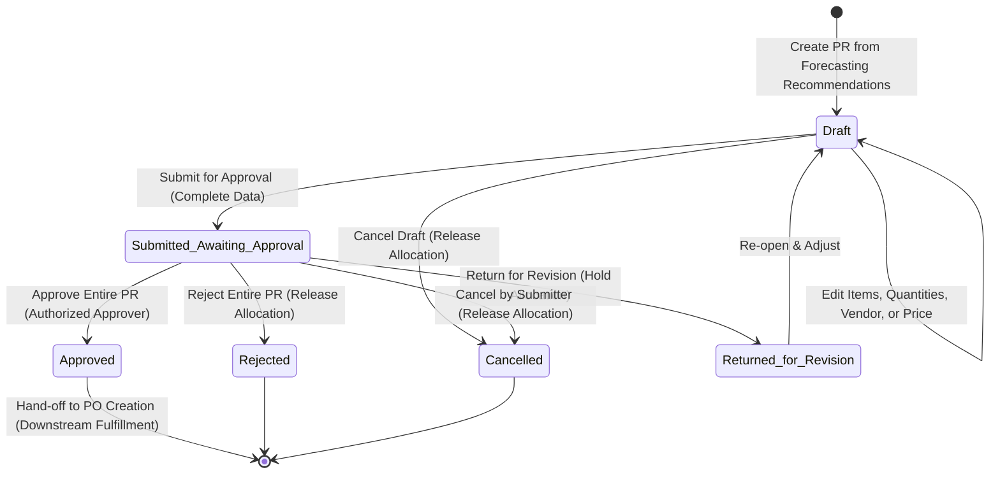

# OUTCOME: Purchase Request (PR)

| Field       | Value        |
|-------------|--------------|
| Code        | OC-13-03     |
| Version     | 1.1          |
| Status      | Review       |
| LastUpdated | 2026-10-10   |

---

## 1. Business Purpose & Statement

***Purchase Request* (PR)** merepresentasikan pencatatan fakta pengajuan pengadaan material resmi internal rumah sakit berbasis hasil perencanaan:
> *"Fungsi Pengadaan/Unit Kerja mengajukan rencana pembelian material X sejumlah Y dengan estimasi biaya Z dan usulan vendor V berdasarkan rekomendasi Forecasting untuk disetujui oleh Pejabat Berwenang."*

Outcome ini memastikan dokumen pengajuan **Purchase Request (PR)** resmi internal rumah sakit berbasis rekomendasi Forecasting **telah berhasil dibentuk, divalidasi kelengkapannya, dan diputuskan status akhirnya (`Approved`, `Rejected`, atau `Cancelled`) sebagai rekaman persisten (*persisted record*)—merekam rincian item kebutuhan, kuantitas rencana beli beserta justifikasi penyesuaian, estimasi harga satuan & total biaya, usulan vendor, alokasi kuantitas rekomendasi, keterlacakan rekomendasi sumber, serta riwayat persetujuan menyeluruh secara transparan—siap dijadikan acuan resmi bagi penerbitan Purchase Order (PO).**

Dokumen PR murni merupakan **dokumen pengajuan internal** dan terpisah secara tegas dari perikatan komersial eksternal (Purchase Order), penerimaan fisik barang (Delivery Order), maupun pencatatan utang usaha (Faktur Tagihan).

---

## 2. Participating Domains & Capabilities

| Domain | Capability | Role in this Outcome |
|--------|------------|----------------------|
| **Purchasing** | `PUR-PURREQ` `PUR-FORECAST`*(Candidate)* `PUR-SUPPLIER` `PUR-PO` | **Pemilik Outcome**: Mengelola pembentukan PR, mengonsumsi rekomendasi Forecasting, mencatat usulan vendor, mengelola siklus alokasi kuantitas rekomendasi, memfasilitasi persetujuan pejabat berwenang, dan menyediakan baseline resmi bagi Purchase Order (`PUR-PO`). |
| **Inventory** | `INV-MASTER` | Menyediakan data katalog item master aktif, deskripsi barang, kelompok komoditas, dan satuan ukuran standar (*UOM*). |
| **Organisasi** | `ORG-LAYANAN` `ORG-PPA` | Menyediakan struktur unit kerja pemohon/asal kebutuhan dan memvalidasi kewenangan pengguna pengaju maupun pejabat penyetuju (*approver*). |

> *Catatan Tata Kelola:* Kapabilitas `PUR-FORECAST` berstatus *Capability Candidate* yang menjadi upstream bagi PR. `PUR-PO` berposisi sebagai konsumen hilir (*downstream*) yang menerima PR berstatus `Approved`.

---

## 3. Core Business Rules & Invariants

1. **Basis Tunggal Pembentukan (Forecasting-Driven):** PR hanya dapat dibuat berdasarkan rekomendasi pengadaan yang berstatus sah (`Valid Recommendation`) dari dokumen Forecasting yang telah `Finalized` (`OC-13-02`). Pembentukan item PR mandiri tanpa referensi baris rekomendasi forecasting dilarang.
2. **Konsolidasi Seragam (Homogeneous Purchasing Group):** Satu PR dapat menggabungkan beberapa rekomendasi Forecasting dan lintas unit kerja, asalkan seluruh rekomendasi berada dalam kelompok/fungsi pengadaan yang sama (misal: Farmasi/Obat, BMHP, atau Logistik Umum).
3. **Keterlacakan Penuh & Snapshot Rekomendasi:** Setiap baris item PR menyimpan tautan ke dokumen Forecasting sumber, ID rekomendasi, dan unit asal, serta menyimpan snapshot data rekomendasi saat PR dibuat (tidak berubah otomatis jika forecasting direvisi di kemudian hari).
4. **Penyesuaian Kuantitas Disertai Justifikasi:** Kuantitas rencana beli dapat disesuaikan dari kuantitas rekomendasi ($\Delta Q \ne 0$), dengan kewajiban mencantumkan alasan justifikasi tertulis.
5. **Integritas Siklus Alokasi Kuantitas Rekomendasi:**
   - *Alokasi saat Draft:* Kuantitas rekomendasi dialokasikan segera saat PR dibuat untuk mencegah pengajuan ganda (*anti-duplicate submission*).
   - *Retensi saat Review & Revisi:* Alokasi kuantitas tetap terkunci selama PR berstatus `Draft`, `Submitted / Awaiting Approval`, dan `Returned for Revision`.
   - *Pelepasan saat Batal / Tolak:* Alokasi kuantitas otomatis dilepas kembali ke pool kebutuhan saat PR berstatus `Cancelled` atau `Rejected`.
   - *Peralihan Tanggung Jawab saat Approved:* Tanggung jawab tata kelola alokasi kuantitas pada OC-13-03 berakhir saat PR berstatus `Approved` dan beralih ke proses pengadaan lanjutan (`PUR-PO`).
6. **Kelengkapan Finansial & Usulan Vendor Sebelum Pengajuan:** PR hanya dapat diajukan (*Submitted*) apabila setiap baris item telah memiliki estimasi harga satuan ($> 0$), total estimasi biaya terhitung, dan usulan vendor (terdaftar atau usulan baru) telah dicantumkan.
7. **Pemisahan Otorisasi Anggaran:** PR mencatat estimasi biaya untuk evaluasi internal dan tidak melakukan validasi kecukupan plafon anggaran secara otomatis.
8. **Independensi Vendor Baru:** Pencatatan usulan vendor baru pada PR tidak otomatis mendaftarkan vendor ke master supplier (`PUR-SUPPLIER`).
9. **Persetujuan Dokumen Menyeluruh (*Whole-Document Single-Approver*):** Keputusan approver berlaku untuk **keseluruhan dokumen PR** (tidak ada persetujuan parsial per item). Hasil keputusan: `Approved`, `Rejected`, atau `Returned for Revision`.
10. **Kewajiban Alasan Keputusan:** Alasan keputusan wajib dicatat secara tertulis apabila dokumen berstatus `Rejected` atau `Returned for Revision`.
11. **Penguncian Dokumen Selama Pengajuan (*Document Locking*):** PR berstatus `Submitted / Awaiting Approval` terkunci (*read-only*) bagi pengaju. Perbaikan data hanya dapat dilakukan jika approver mengembalikan dokumen (`Returned for Revision`).
12. **Hak Pembatalan Pengaju:** Pengaju dapat membatalkan PR selama belum ada keputusan resmi dari approver, dengan kewajiban mencatat alasan pembatalan.
13. **Finalitas Penolakan (*Rejection Finality*):** PR berstatus `Rejected` berakhir permanen (*read-only*) dan tidak dapat diedit/diajukan ulang. Pengajuan kebutuhan baru harus melalui nomor dokumen PR baru.
14. **Bukan PO dan Bukan Komitmen Finansial:** Dokumen PR dilarang menerbitkan Purchase Order ke supplier, dilarang menimbulkan utang piutang usaha, dan dilarang mengubah saldo fisik persediaan gudang.

---

## 4. Required Recorded Information

- **Header Dokumen PR:**
  - Nomor unik PR (misal `PR-YYYYMM-XXXX`).
  - Identitas Pengaju (`Created By`, `Created At`) & Unit Kerja Pengaju.
  - Kelompok/Fungsi Pengadaan (misal Farmasi, BMHP, Logistik Umum).
  - Status Dokumen (`Draft`, `Submitted / Awaiting Approval`, `Returned for Revision`, `Approved`, `Rejected`, `Cancelled`).
  - Usulan Vendor (*Proposed Vendor*): Tipe (`Registered Vendor` / `New Proposed Vendor`), Kode & Nama Vendor (`PUR-SUPPLIER`) atau Nama & Kontak Usulan Baru.
  - Justifikasi Pengadaan Umum & Total Estimasi Biaya PR ($\sum \text{Subtotal Item}$).
  - Keputusan Persetujuan: Identitas Approver, Tanggal/Waktu Keputusan, Hasil Keputusan (`Approved`, `Rejected`, `Returned for Revision`), dan Alasan Keputusan (wajib bila ditolak/dikembalikan).
  - Catatan Pembatalan: Identitas Pembatal, Tanggal/Waktu Batal, dan Alasan Pembatalan (jika dibatalkan pengaju).
- **Rincian Item PR (Lines):**
  - Identitas Material: Kode item, Nama material (`INV-MASTER`), Kategori, dan Satuan Ukuran Rencana Beli (*UOM*).
  - Referensi Sumber: Unit Kerja Asal Kebutuhan (`ORG-LAYANAN`), Nomor Dokumen Forecasting (`OC-13-02`), dan ID Baris Rekomendasi.
  - Kuantitas & Penyesuaian: Kuantitas Rekomendasi Asal (*Snapshot Qty*), Kuantitas Rencana Beli (**Requested PR Quantity** > 0), Selisih Kuantitas ($\Delta Q$), dan Justifikasi Penyesuaian (wajib bila $\Delta Q \ne 0$).
  - Nilai Finansial Item: Estimasi Harga Satuan (**Estimated Unit Price** > 0) dan Subtotal Estimasi Biaya Item ($\text{Qty} \times \text{Harga Satuan}$).
  - Catatan Spesifikasi Teknis/Merek Item (opsional).
- **Audit & Riwayat Status:**
  - Jejak audit kronologis perubahan status, stempel waktu, dan pengguna penanggung jawab.

---

## 5. Lifecycle & State Machine

| State | Keterangan & Aksi yang Diizinkan |
|---|---|
| **Draft** | Dokumen dalam penyusunan; kuantitas rekomendasi dialokasikan; bebas edit item/harga/vendor, ajukan persetujuan, atau batalkan. |
| **Submitted / Awaiting Approval** | Dokumen terkunci (*read-only*); menunggu evaluasi approver tunggal; pengaju dapat membatalkan sebelum diputus. |
| **Returned for Revision** | Dokumen dikembalikan approver; alokasi kuantitas tetap ditahan; pengaju dapat memperbaiki data untuk diajukan ulang. |
| **Approved** | PR disahkan resmi secara menyeluruh; terkunci permanen; siap diserahterimakan sebagai acuan penerbitan Purchase Order (`OC-13-04`). |
| **Rejected** | PR ditolak permanen; alokasi kuantitas rekomendasi dilepas kembali ke pool kebutuhan (*read-only*). |
| **Cancelled** | PR dibatalkan mandiri oleh pengaju; alokasi kuantitas rekomendasi dilepas kembali ke pool kebutuhan (*read-only*). |

---

## 6. Boundary & Out of Scope

| In Scope (OC-13-03) | Out of Scope (Domain / Outcome Lain) |
|---|---|
| Penarikan rekomendasi pengadaan dari dokumen Forecasting valid | Kalkulasi proyeksi konsumsi & rekomendasi kuantitas (`OC-13-02`) |
| Konsolidasi item multi-rekomendasi dalam kelompok pengadaan seragam | Verifikasi legalitas & registrasi vendor master (`PUR-SUPPLIER`) |
| Pencatatan estimasi harga, usulan vendor, & justifikasi penyesuaian | Validasi plafon anggaran keuangan & pengesahan kas (`TRK-*`) |
| Pengelolaan siklus alokasi kuantitas rekomendasi internal PR | Pembentukan kontrak PO & komitmen pemesanan supplier (`OC-13-04`) |
| Otorisasi persetujuan menyeluruh (`Approved`, `Rejected`, `Returned`) | Penerimaan fisik barang di gudang & surat jalan (`OC-12-01`, `PUR-DO`) |
| Serah terima dokumen PR disetujui ke alur Purchase Order | Verifikasi faktur tagihan supplier & pembayaran kasir (`OC-13-05`, `TRK-*`) |

---

## 7. Acceptance Criteria

| # | Kriteria Keberhasilan | Validasi |
|---|---|---|
| **AC-01** | Sistem berhasil membentuk dokumen PR persisten hanya dari baris rekomendasi berstatus `Valid Recommendation` pada dokumen Forecasting `Finalized` (`OC-13-02`). | Kelengkapan |
| **AC-02** | Sistem mengizinkan konsolidasi multi-rekomendasi lintas unit dalam satu kelompok pengadaan seragam, dan menolak konsolidasi antar-kelompok pengadaan yang berbeda. | Integritas Bisnis |
| **AC-03** | Setiap baris item PR menyimpan referensi dokumen forecasting sumber, ID rekomendasi, unit asal, dan data snapshot rekomendasi yang tidak berubah jika forecasting direvisi. | Keterlacakan |
| **AC-04** | Pengguna dapat menyesuaikan kuantitas rencana beli dari kuantitas rekomendasi, dengan kewajiban mencantumkan justifikasi tertulis untuk setiap selisih kuantitas. | Fungsional |
| **AC-05** | Sistem mengalokasikan kuantitas rekomendasi saat PR dibuat, mempertahankan alokasi saat `Returned for Revision`, dan melepas alokasi saat `Cancelled` atau `Rejected`. | Integritas Alokasi |
| **AC-06** | Sistem memblokir pengajuan PR (*Submit*) apabila terdapat baris item tanpa estimasi harga satuan valid (> 0) atau belum memuat usulan vendor. | Validasi Data |
| **AC-07** | Dokumen PR terkunci (*read-only*) bagi pengaju selama berstatus `Submitted / Awaiting Approval`. | Integritas Data |
| **AC-08** | Approver berwenang dapat menetapkan keputusan menyeluruh (`Approved`, `Rejected`, atau `Returned for Revision`), dan sistem menolak keputusan parsial per baris item. | Otorisasi |
| **AC-09** | Penetapan keputusan `Rejected` dan `Returned for Revision` mewajibkan pengisian alasan keputusan tertulis. | Validasi Otorisasi |
| **AC-10** | Pengaju dapat membatalkan PR sebelum ada putusan approver dengan mencatat alasan pembatalan, dan sistem otomatis melepas alokasi kuantitas rekomendasi. | Fungsional |
| **AC-11** | Dokumen PR berstatus `Rejected` bersifat final/permanen dan tidak dapat diajukan ulang melalui nomor dokumen yang sama. | Integritas Status |
| **AC-12** | Pembentukan dan persetujuan PR tidak memicu penerbitan PO supplier, tidak memotong/menambah saldo fisik inventori, dan tidak menimbulkan kewajiban utang usaha. | Batasan (*Boundary*) |
| **AC-13** | Dokumen PR berstatus `Approved` terkunci permanen dan dapat diakses sebagai referensi resmi bagi proses penerbitan Purchase Order (`OC-13-04`). | Keterlacakan |

---

## 8. Open Business Decisions

1. **Matriks Penentuan Approver Tunggal Berwenang:** Aturan penentuan pejabat approver berdasarkan threshold nominal estimasi biaya, kelompok komoditas, atau struktur unit pemohon.
2. **Batas Toleransi Deviasi Kuantitas terhadap Rekomendasi:** Batas persentase kenaikan kuantitas PR terhadap rekomendasi forecasting (misal > 20%) yang memerlukan eskalasi persetujuan khusus.
3. **Prosedur Verifikasi Usulan Vendor Baru:** Penetapan waktu pelaksanaan evaluasi/registrasi vendor baru ke master supplier (sebelum approval PR atau saat penyusunan PO).
4. **Batas Waktu Kedaluwarsa Draf & PR Revisi (*Expiration Policy*):** Kebijakan batas waktu draf PR atau status *Returned for Revision* sebelum dibatalkan otomatis demi melepas penguncian alokasi kuantitas.
