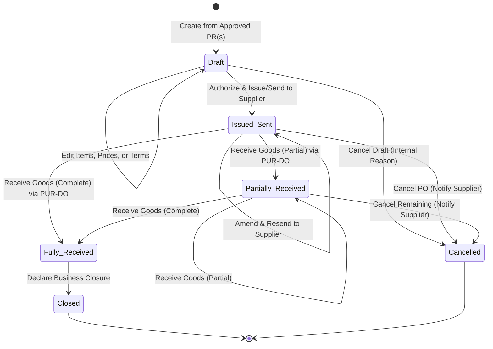

# OUTCOME: Purchase Order (PO)

| Field       | Value        |
|-------------|--------------|
| Code        | OC-13-04     |
| Version     | 1.2          |
| Status      | Review       |
| LastUpdated | 2026-10-10   |

---

## 1. Business Purpose & Statement

**Purchase Order (PO)** merepresentasikan pencatatan fakta komitmen pemesanan resmi rumah sakit kepada pihak eksternal (*supplier/vendor*):
> *"Rumah sakit secara resmi berkomitmen membeli barang/material tertentu kepada supplier/vendor yang ditunjuk dengan kuantitas, harga, dan ketentuan yang disepakati, berdasarkan Purchase Request yang telah disetujui."*

Outcome ini memastikan dokumen **Purchase Order (PO)** resmi rumah sakit kepada supplier/vendor **tersedia sebagai komitmen pemesanan persisten yang dibentuk dari Purchase Request (PR) yang telah disetujui—memuat ketentuan pemesanan yang diotorisasi, dikirimkan secara resmi ke supplier, serta mempertahankan keterlacakan perubahan, progres pemenuhan barang, pembatalan, dan penyelesaian bisnisnya.**

Dokumen PO membedakan secara tegas antara persiapan internal (*Draft*) dengan komitmen resmi (*Issued/Sent*), serta terpisah secara fungsional dari pencatatan fisik penerimaan barang (`PUR-DO`) maupun verifikasi faktur dan pelunasan utang (`PUR-FAKTUR` dan domain keuangan).

---

## 2. Participating Domains & Capabilities

| Domain | Capability | Role in this Outcome |
|--------|------------|----------------------|
| **Purchasing** | `PUR-PO` `PUR-PURREQ` `PUR-SUPPLIER` | **Pemilik Outcome**: Mengelola siklus dokumen PO, menarik alokasi item kebutuhan dari PR yang disetujui (`OC-13-03`), dan menetapkan perikatan dengan supplier/vendor definitif. |
| **Purchasing** | `PUR-DO` `PUR-FAKTUR` | **Downstream**: `PUR-DO` menyediakan informasi realisasi penerimaan fisik untuk direfleksikan ke status PO. `PUR-FAKTUR` mengonsumsi data komitmen PO untuk pencocokan tagihan. |
| **Inventory** | `INV-MASTER` | Menyediakan data katalog item master aktif dan satuan ukuran standar (*UOM*). |
| **Organisasi** | `ORG-LAYANAN` `ORG-PPA` | Menyediakan data struktur lokasi tujuan penyerahan barang dan otorisasi pejabat berwenang. |

---

## 3. Core Business Rules & Invariants

1. **Basis Tunggal Pembentukan (PR-Driven):** PO hanya dapat dibentuk berdasarkan dokumen Purchase Request (PR) yang telah disetujui (`Approved` pada `OC-13-03`).
2. **Kardinalitas Hubungan PR ke PO (1 : N):** Satu dokumen PR yang disetujui dapat menghasilkan satu atau beberapa dokumen PO (pemesanan parsial/beda vendor), dengan total pemesanan tidak melampaui alokasi kuantitas PR asal.
3. **Pemisahan Tahapan Komitmen:** Status `Draft` murni persiapan internal. PO resmi menjadi komitmen hukum/bisnis hanya setelah diotorisasi, beralih status ke `Issued/Sent`, dan dikirimkan resmi ke supplier.
4. **Perubahan Terkontrol (Controlled Amendment):** Perubahan pasca-penerbitan hanya boleh memengaruhi komitmen terbuka, dilarang mengubah riwayat penerimaan yang telah tercatat, dan wajib melalui otorisasi serta dikirim ulang (*resend*) kepada supplier.
5. **Mekanisme Pembatalan:** Pembatalan pada status `Draft` cukup alasan internal. Pembatalan pada status `Issued/Sent` atau `Partially Received` wajib diiringi alasan tertulis dan notifikasi resmi kepada supplier (mengakhiri sisa komitmen tanpa menghapus riwayat penerimaan yang sudah ada).
6. **Pelacakan Pemenuhan Eksternal (Read-Only Receipt):** Progres kuantitas yang diterima (*Received Quantity*) direfleksikan murni dari data penerimaan fisik (`PUR-DO`). PO tidak mencatat/menambah penerimaan barang secara langsung.
7. **Pemisahan Fully Received vs Closed:** Penerimaan seluruh barang (`Fully Received`) tidak otomatis menutup PO secara bisnis. Status `Closed` adalah pernyataan penyelesaian bisnis eksplisit (misal: rekonsiliasi tuntas).
8. **Isolasi Domain Fisik & Finansial:** Penerbitan atau perubahan PO dilarang memotong/menambah saldo fisik inventori, dan dilarang mencatat pembayaran/pelunasan keuangan.

---

## 4. Required Recorded Information

- **Header Dokumen PO:**
  - Nomor unik PO (misal `PO-YYYYMM-XXXX`) & Penanda versi revisi (*Document Version*).
  - Status Dokumen (`Draft`, `Issued/Sent`, `Partially Received`, `Fully Received`, `Closed`, `Cancelled`).
  - Data Supplier/Vendor (`PUR-SUPPLIER`): Kode, Nama, dan Kontak Resmi.
  - Syarat Operasional: Lokasi gudang tujuan (`ORG-LAYANAN`) dan Target tanggal pengiriman.
  - Komersial & Finansial: Syarat pembayaran (*Terms of Payment*), Mata uang, dan Total Nilai Akhir PO.
  - Otorisasi & Komunikasi: Identitas penyusun, Pejabat Pemberi Otorisasi, serta log pengiriman resmi (waktu & kanal) ke supplier.
  - Catatan Batal/Tutup: Alasan pembatalan, waktu, aktor, dan konfirmasi notifikasi supplier.
- **Rincian Item PO (Lines):**
  - Identitas Material & Referensi: Kode/Nama item (`INV-MASTER`), Satuan (*UOM*), dan Referensi dokumen PR asal.
  - Komitmen Finansial: Kuantitas dipesan (*Ordered Qty*), Harga Satuan (*Agreed Unit Price* $\ge 0$), Diskon, dan Subtotal.
  - Progres Pemenuhan: Kuantitas diterima (*Received Qty*, *dari PUR-DO*), Kuantitas sisa terbuka (*Open Qty*), dan Status pemenuhan item.
- **Audit & Riwayat Perubahan:**
  - Jejak audit kronologis setiap amendment (perubahan harga/kuantitas), transisi status, dan riwayat pengiriman dokumen ke supplier.

---

## 5. Lifecycle & State Machine

| State | Keterangan & Aksi yang Diizinkan |
|---|---|
| **Draft** | Persiapan internal; bebas sunting; dapat dibatalkan tanpa notifikasi supplier. |
| **Issued/Sent** | Komitmen pemesanan aktif; otorisasi selesai & dokumen resmi dikirim ke supplier. |
| **Partially Received** | Barang diterima sebagian; menunggu sisa barang atau pembatalan sisa komitmen (`Cancelled`). |
| **Fully Received** | Seluruh kuantitas barang diterima; menunggu penutupan penyelesaian administrasi bisnis. |
| **Closed** | Dokumen dinyatakan selesai secara bisnis secara formal; terkunci permanen (*read-only*). |
| **Cancelled** | Komitmen dihentikan/dibatalkan; riwayat penerimaan sebelumnya (jika ada) tetap sah; terkunci permanen. |

---

## 6. Boundary & Out of Scope

| In Scope (OC-13-04) | Out of Scope (Domain / Outcome Lain) |
|---|---|
| Penarikan alokasi PR & penetapan kesepakatan pemesanan | Persetujuan awal kebutuhan material internal (`OC-13-03`) |
| Pencatatan otorisasi, amendment, & log pengiriman vendor | Pencatatan fisik penerimaan barang dan surat jalan (`PUR-DO`) |
| Pelacakan agregat progres penerimaan barang dari `PUR-DO` | Mutasi saldo persediaan fisik gudang (`INV-STOK`, `INV-MUTASI`) |
| Pelaksanaan terminasi komitmen pembatalan (`Cancelled`) | Verifikasi faktur tagihan supplier (`PUR-FAKTUR` / `OC-13-05`) |
| Deklarasi penyelesaian dokumen secara bisnis (`Closed`) | Pembayaran utang usaha atau disbursement kas (`TRK-*`) |

---

## 7. Acceptance Criteria

| # | Kriteria Keberhasilan | Validasi |
|---|---|---|
| **AC-01** | Sistem berhasil membentuk dokumen PO persisten hanya dari item Purchase Request yang berstatus `Approved` (`OC-13-03`). | Kelengkapan |
| **AC-02** | Sistem mengizinkan mekanisme pemecahan (1 PR ke N PO) dengan validasi agregat alokasi kuantitas tidak melebihi persetujuan sisa PR asal. | Integritas Bisnis |
| **AC-03** | PO berstatus `Draft` tersimpan sebagai persiapan internal dan tidak diakui sebagai komitmen pemesanan resmi rumah sakit. | Integritas Status |
| **AC-04** | PO berpindah ke status `Issued/Sent` hanya setelah diotorisasi sesuai kebijakan dan mencatat log stempel waktu/kanal pengiriman resmi ke supplier. | Otorisasi & Komunikasi |
| **AC-05** | Amendment atas PO `Issued/Sent` hanya mengubah komitmen terbuka, menghasilkan penanda versi, dan mewajibkan pencatatan log pengiriman ulang. | Perubahan Terkontrol |
| **AC-06** | Pembatalan PO `Draft` mewajibkan alasan internal. Pembatalan PO pasca-penerbitan juga mewajibkan pencatatan notifikasi supplier dan tidak menghapus riwayat penerimaan sebelumnya. | Pembatalan Terkontrol |
| **AC-07** | Progres penerimaan per baris item direfleksikan otomatis dari pencatatan `PUR-DO` (*Read-Only* pada PO) dan diagregasikan menjadi status dokumen (`Partially / Fully Received`). | Pelacakan Progres |
| **AC-08** | Sistem mencegah perubahan status otomatis menjadi `Closed` hanya karena barang telah `Fully Received`, melainkan membutuhkan deklarasi penyelesaian formal. | Integritas Bisnis |
| **AC-09** | Pembentukan, perubahan, atau penyelesaian PO tidak menambah stok inventori secara langsung dan tidak mencatat pembayaran utang usaha. | Batasan (*Boundary*) |
| **AC-10** | Seluruh amandemen kuantitas/harga, perubahan status, log pengiriman vendor, dan deklarasi pembatalan dapat ditelusuri melalui jejak audit kronologis. | Keterlacakan |

---

## 8. Open Business Decisions

1. **Matriks Otorisasi & Batas Toleransi (*Amendment Policy*):** Aturan otorisasi penerbitan awal dan penentuan batas deviasi harga/kuantitas yang mewajibkan re-otorisasi penuh vs penyesuaian administratif.
2. **Kriteria Penutupan Bisnis (`Closed`):** Prasyarat definitif penyelesaian PO, apakah mensyaratkan pencocokan faktur (*3-way matching*) atau sekadar serah terima pengadaan.
3. **Kanal Standar Komunikasi:** Penentuan media komunikasi eksternal resmi yang diakui secara legal (email terintegrasi, portal vendor, atau cetak fisik bermeterai).
