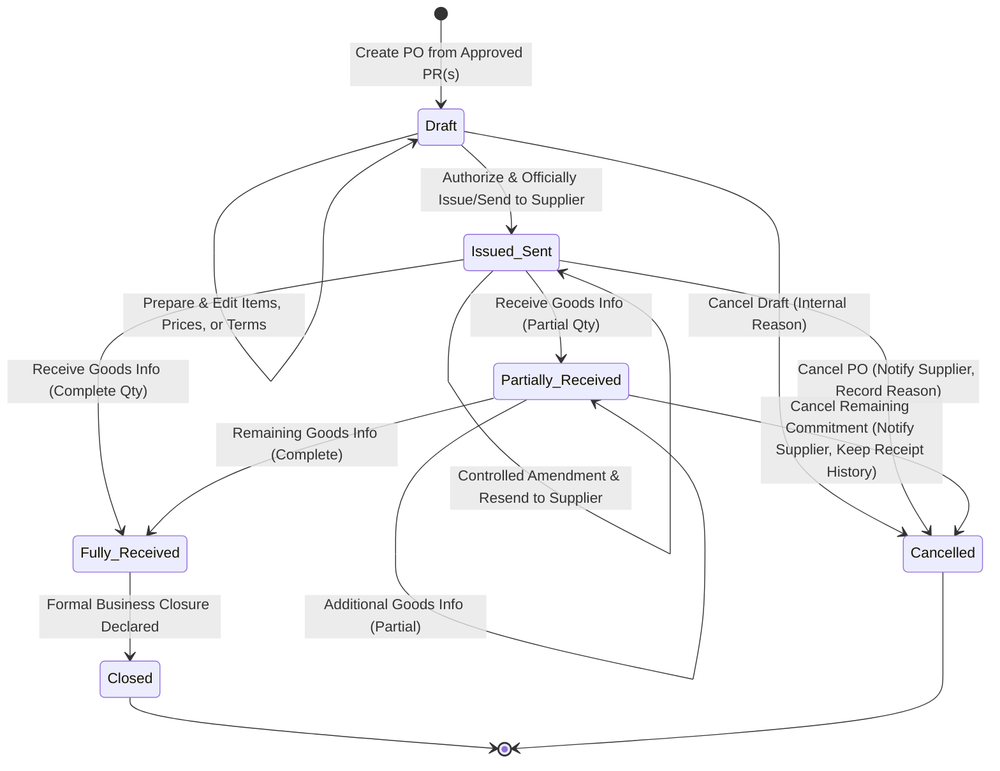

# OUTCOME: Purchase Order (PO)

| Field       | Value        |
|-------------|--------------|
| Code        | OC-13-04     |
| Version     | 1.1          |
| Status      | Review       |
| LastUpdated | 2026-10-10   |

---

## 1. Business Purpose & Statement

### 1.1 Business Purpose
Purchase Order (PO) merepresentasikan pencatatan komitmen pemesanan resmi rumah sakit kepada pihak eksternal (*supplier/vendor*):
> *"Rumah sakit secara resmi berkomitmen memesan dan membeli barang/material tertentu kepada supplier/vendor yang ditunjuk dengan kuantitas, harga, dan ketentuan pemesanan yang disepakati, berdasarkan kebutuhan pengadaan yang telah disetujui sebelumnya."*

Purchase Order dibentuk berdasarkan dokumen **Purchase Request (PR)** yang telah disetujui (`Approved` pada `OC-13-03`). Dokumen PO berfungsi sebagai instrumen perikatan pemesanan resmi rumah sakit yang menjadi dasar rujukan bagi supplier untuk mengirimkan barang, bagi unit penerima/gudang untuk memverifikasi kedatangan barang (*Delivery Order / Goods Receipt*), serta bagi fungsi penagihan untuk mencocokkan faktur komersial (*Supplier Invoice*).

### 1.2 Outcome Statement
Dokumen **Purchase Order (PO)** resmi rumah sakit kepada supplier/vendor **tersedia sebagai komitmen pemesanan yang dibentuk dari Purchase Request (PR) yang telah disetujui, memuat ketentuan pemesanan yang diotorisasi dan dikirimkan secara resmi, serta mempertahankan keterlacakan perubahan, progres pemenuhan, pembatalan, dan penyelesaian bisnisnya.**

Dokumen PO membedakan secara tegas antara persiapan internal (*Draft*) dengan komitmen resmi (*Issued/Sent*), serta terpisah secara fungsional dari pencatatan fisik penerimaan barang di gudang, mutasi saldo persediaan, dan pembayaran finansial.

---

## 2. Participating Domains & Capabilities

| Domain | Capability | Role in this Outcome |
|--------|------------|----------------------|
| **Purchasing** | `PUR-PO` | **Pemilik Outcome**: Mengelola seluruh siklus hidup dokumen Purchase Order—mulai dari penyusunan draf, fasilitasi otorisasi, penerbitan & pengiriman resmi ke supplier, pencatatan perubahan terkontrol, pelacakan agregat progres penerimaan, pembatalan, hingga penutupan bisnis (*Closed*). |
| **Purchasing** | `PUR-PURREQ` | **Upstream Baseline**: Menyediakan acuan dokumen Purchase Request yang telah disetujui (`Approved` pada `OC-13-03`) beserta alokasi item kebutuhan yang menjadi dasar pembentukan PO. |
| **Purchasing** | `PUR-SUPPLIER` | Menyediakan data definitif supplier/vendor yang dituju (identitas, alamat, kontak resmi, dan ketentuan komersial). |
| **Purchasing** | `PUR-DO` | **Downstream Informant**: Menyediakan informasi realisasi penerimaan fisik barang dari supplier untuk direfleksikan ke dalam status dan progres penerimaan item PO. |
| **Purchasing** | `PUR-FAKTUR` | **Downstream Consumer**: Mengonsumsi data komitmen PO dan status pemenuhan barang sebagai acuan verifikasi faktur tagihan supplier (`OC-13-05`). |
| **Inventory** | `INV-MASTER` | Menyediakan katalog data master material aktif, deskripsi barang, kemasan, dan satuan ukuran standar (*UOM*). *(Catatan: Inventory tidak menerima perubahan stok langsung dari PO).* |
| **Organisasi** | `ORG-LAYANAN` `ORG-PPA` | Menyediakan struktur unit kerja pemesan, lokasi/gudang tujuan penyerahan barang, serta memvalidasi kewenangan staf pembuat PO dan pejabat pemberi otorisasi penerbitan. |

---

## 3. Core Business Rules & Invariants

### 3.1 Hubungan Purchase Request (PR) dan Purchase Order (PO)
1. **Basis Tunggal Pembentukan (PR-Driven):** PO dibentuk berdasarkan Purchase Request (PR) yang telah berstatus disetujui (`Approved` pada `OC-13-03`). Pembuatan PO tanpa dasar PR yang sah tidak diperkenankan.
2. **Kardinalitas Hubungan PR ke PO (1 : N):**
   - Satu dokumen PR yang telah disetujui dapat menghasilkan satu atau beberapa dokumen PO.
   - Mekanisme 1 PR ke banyak PO memungkinkan item-item dalam satu PR dipesan kepada supplier/vendor yang berbeda sesuai spesialisasi/katalog rekanan, atau diproses melalui pemesanan terpisah/bertahap sesuai jadwal pengadaan rumah sakit.
3. **Integritas Alokasi Kuantitas PR:**
   - Kuantitas item PR yang ditarik ke dalam PO dialokasikan dan dipantau agar total kuantitas pemesanan pada seluruh PO turunan tidak melampaui kuantitas yang disetujui pada PR asal tanpa justifikasi resmi.

### 3.2 Pemisahan Tahapan: Persiapan, Otorisasi, dan Penerbitan Resmi
1. **Persiapan Internal (*Draft*):**
   - Dokumen PO berstatus `Draft` murni merupakan instrumen persiapan administratif internal rumah sakit.
   - Pada status `Draft`, PO **belum menjadi komitmen pemesanan resmi** dan belum menimbulkan hak maupun kewajiban hukum/bisnis terhadap supplier/vendor.
2. **Otorisasi Penerbitan Mengikuti Kebijakan Rumah Sakit:**
   - Penerbitan PO wajib melalui otorisasi oleh pejabat rumah sakit yang berwenang sebelum dapat dikirimkan kepada supplier.
   - Outcome ini **tidak menetapkan satu model persetujuan universal** (misalnya tidak mendikte struktur bertingkat, matriks limit nominal, atau delegasi wewenang tertentu); implementasi otorisasi tunduk pada kebijakan tata kelola rumah sakit yang berlaku.
3. **Penerbitan dan Pengiriman Resmi (*Issued/Sent*):**
   - PO resmi menjadi komitmen pemesanan rumah sakit ketika dokumen telah diotorisasi, diterbitkan, dan **dikirim secara resmi kepada supplier/vendor**.
   - Dokumen berpindah status menjadi `Issued/Sent` dan mulai berlaku sebagai dasar pemenuhan pesanan oleh rekanan.

### 3.3 Mekanisme Perubahan Terkontrol (*Controlled Amendments*)
1. **Perubahan Terkontrol Pasca-Penerbitan:**
   - PO yang telah berstatus `Issued/Sent` dapat mengalami perubahan melalui mekanisme yang terkontrol apabila terjadi penyesuaian kesepakatan (misalnya perubahan kuantitas, harga kesepakatan, jadwal pengiriman, atau spesifikasi item).
2. **Keterlacakan Riwayat Perubahan (*Auditability*):**
   - Setiap perubahan wajib mencatat identitas pengubah, waktu perubahan, bagian yang diubah, dan alasan perubahan secara transparan.
   - Riwayat perubahan harus dapat ditelusuri kembali secara utuh (*traceable change history*).
3. **Batas Perubahan, Penetapan Versi Aktif & Pengiriman Kembali Resmi:**
   - Amendment hanya boleh memengaruhi komitmen PO yang masih terbuka. Riwayat penerimaan yang telah tercatat tidak boleh diubah melalui amendment PO.
   - Perubahan yang memengaruhi kuantitas, harga, syarat pemesanan, atau jadwal pengiriman wajib mengikuti otorisasi yang dipersyaratkan oleh kebijakan rumah sakit.
   - Versi atau perubahan yang berlaku harus dapat dibedakan dan ditelusuri dengan jelas oleh pihak rumah sakit maupun supplier.
   - PO yang telah diperbarui **wajib dikirim kembali secara resmi kepada supplier/vendor** agar kedua pihak memegang komitmen yang selaras.
   - Outcome ini tidak menetapkan detail teknis format penomoran versi atau aturan otorisasi per jenis perubahan, melainkan memastikan prinsip keterlacakan dan pengiriman ulang terpenuhi sesuai kebijakan rumah sakit.

### 3.4 Mekanisme Pembatalan Terkontrol (*Controlled Cancellation*)
1. **Pencatatan Alasan & Keterlacakan Pembatalan:**
   - Pembatalan PO dilakukan melalui mekanisme terkontrol dengan kewajiban mencatat alasan pembatalan tertulis serta identitas aktor dan stempel waktu pembatalan.
   - Seluruh perubahan status dan riwayat pembatalan dapat ditelusuri.
2. **Pemberitahuan Resmi kepada Supplier:**
   - Untuk PO yang telah berstatus `Issued/Sent` atau `Partially Received`, supplier/vendor wajib diberi tahu secara resmi bahwa PO yang bersangkutan telah dibatalkan.
   - Pembatalan pada status `Draft` hanya memerlukan alasan pembatalan internal karena PO belum dikirim kepada supplier/vendor.
3. **Pembatalan PO Berstatus Partially Received:**
   - PO yang berada pada status `Partially Received` **dapat dibatalkan** untuk mengakhiri sisa komitmen kuantitas yang belum dipenuhi oleh supplier.
4. **Pelestarian Riwayat Transaksi (*Non-Destructive History*):**
   - Pembatalan PO tidak menghapus atau mengubah riwayat penerimaan barang yang telah terjadi sebelumnya. Penerimaan yang telah tercatat tetap sah dan tersimpan sebagai fakta historis.
5. **Makna Bisnis Status Cancelled:**
   - Status `Cancelled` menandakan bahwa dokumen PO tidak lagi aktif sebagai komitmen pemesanan berjalan, tanpa menghilangkan jejak audit transaksi sebelumnya.
   - Outcome ini tidak mengasumsikan adanya persetujuan tambahan di luar kebijakan rumah sakit yang berlaku.

### 3.5 Status Bisnis dan Pelacakan Siklus Hidup
1. **Enam Status Bisnis Pokok:**
   Siklus hidup PO diatur berdasarkan status bisnis berikut:
   - **`Draft`**: PO masih dalam tahap persiapan internal.
   - **`Issued/Sent`**: PO telah diotorisasi, diterbitkan, dan dikirim secara resmi kepada supplier/vendor.
   - **`Partially Received`**: Sebagian kuantitas pesanan telah diterima, tetapi masih ada kuantitas pesanan yang belum diterima.
   - **`Fully Received`**: Seluruh kuantitas yang dipesan telah diterima secara lengkap.
   - **`Closed`**: Proses PO telah dinyatakan selesai secara bisnis.
   - **`Cancelled`**: PO tidak lagi aktif sebagai komitmen pemesanan.
2. **Pelacakan Item vs Status Dokumen:**
   - Progres pemenuhan penerimaan dilacak secara individual **per baris item** (kuantitas dipesan vs kuantitas telah diterima vs sisa kuantitas terbuka).
   - Status PO di tingkat dokumen merupakan **ringkasan (agregasi) progres penerimaan dari seluruh item** yang dipesan.
3. **Pemisahan Makna Bisnis `Fully Received` vs `Closed`:**
   - `Fully Received` dan `Closed` memiliki makna bisnis yang berbeda.
   - Penerimaan seluruh barang (`Fully Received`) **tidak otomatis menutup PO secara bisnis**.
   - PO berpindah ke status `Closed` hanya ketika seluruh proses bisnis yang disyaratkan (misalnya rekonsiliasi penerimaan, penyelesaian administrasi faktur terkait, atau konfirmasi penutupan resmi) telah dinyatakan selesai secara bisnis sesuai kebijakan rumah sakit.

---

## 4. Required Recorded Information

### 4.1 Header Dokumen Purchase Order
- **Identitas Dokumen & Referensi:**
  - Nomor unik Purchase Order (misal: `PO-YYYYMM-XXXX`).
  - Penandaan versi / identifikasi perubahan yang berlaku (*Document Version / Revision Identifier*).
  - Tanggal pembentukan dokumen (*Creation Date*).
  - Status bisnis dokumen (`Draft`, `Issued/Sent`, `Partially Received`, `Fully Received`, `Closed`, `Cancelled`).
- **Data Supplier/Vendor (`PUR-SUPPLIER`):**
  - Kode dan Nama resmi supplier/vendor.
  - Alamat korespondensi dan kontak resmi penanggung jawab vendor (telepon/email).
- **Data Operasional & Lokasi Penyerahan:**
  - Lokasi / Gudang tujuan penyerahan barang di rumah sakit (`ORG-LAYANAN`).
  - Target tanggal pengiriman yang disepakati (*Expected Delivery Date*).
- **Syarat Komersial & Nilai Finansial:**
  - Syarat pembayaran (*Payment Terms / Commercial Terms*).
  - Ketentuan penyerahan (*Incoterms / Delivery Terms*, bila berlaku).
  - Mata uang transaksi.
  - Total nilai komitmen pemesanan (Subtotal nilai item, diskon/potongan bila ada, pajak/PPN bila berlaku, dan Total Nilai Akhir PO).
- **Otorisasi & Komunikasi Resmi:**
  - Identitas penyusun dokumen (`Created By`, `Created At`).
  - Identitas pejabat pemberi otorisasi penerbitan (*Authorized By*, *Authorized At*, referensi otorisasi).
  - Catatan komunikasi resmi pengiriman dokumen ke supplier (tanggal/waktu kirim, kanal komunikasi, identitas pengirim).
  - Catatan komunikasi resmi pengiriman ulang dokumen revisi (tanggal/waktu kirim ulang, kanal komunikasi).
- **Pencatatan Pembatalan & Penutupan Bisnis:**
  - Data pembatalan (wajib jika `Cancelled`): Alasan pembatalan tertulis, identitas pembatal, tanggal/waktu pembatalan, dan catatan pemberitahuan resmi kepada supplier.
  - Data penutupan bisnis (wajib jika `Closed`): Identitas pihak yang menyatakan penutupan, tanggal/waktu penutupan, dan catatan penyelesaian bisnis.

### 4.2 Rincian Item PO (Lines)
- **Identitas Material & Referensi PR:**
  - Kode dan Nama item material (`INV-MASTER`).
  - Satuan ukuran pemesanan (*Purchase UOM*).
  - Referensi nomor dokumen Purchase Request asal (`OC-13-03`) dan ID baris item PR terkait.
- **Kuantitas & Finansial Item:**
  - Kuantitas yang dipesan (**Ordered Quantity** > 0).
  - Harga satuan kesepakatan (**Agreed Unit Price** $\ge$ 0).
  - Potongan harga / diskon per baris item (jika berlaku).
  - Subtotal nilai komitmen item ($\text{Ordered Quantity} \times \text{Agreed Unit Price} - \text{Diskon}$).
- **Progres Penerimaan Item (*Item-Level Progress*):**
  - Kuantitas yang telah diterima (**Received Quantity**, hanya direfleksikan dari pencatatan penerimaan fisik barang pada `PUR-DO`; tidak diedit langsung pada PO).
  - Kuantitas sisa pesanan yang masih terbuka (**Outstanding / Open Quantity** = $\text{Ordered Quantity} - \text{Received Quantity}$), dengan penyesuaian atas saldo yang dibatalkan bila berlaku.
  - Status pemenuhan item (*Item Fulfillment Status*: misal `Pending`, `Partially Received`, `Fully Received`, `Cancelled Balance`).
- **Instruksi Khusus Item:**
  - Spesifikasi teknis, merek yang disepakati, atau catatan instruksi penanganan barang (opsional).

### 4.3 Jejak Audit & Riwayat Perubahan (*Audit Trail*)
- Riwayat kronologis setiap perubahan yang terjadi pada PO (perubahan kuantitas, harga, penambahan/penghapusan item, atau syarat pemesanan).
- Stempel waktu (*timestamp*), identitas pengguna, nilai sebelum perubahan (*before-value*), dan nilai setelah perubahan (*after-value*).
- Riwayat transisi status dokumen beserta alasan perubahan status.
- Bukti atau riwayat pengiriman dokumen resmi (perdana maupun revisi) dan notifikasi pembatalan kepada supplier/vendor.

---

## 5. Lifecycle & State Machine

### 5.1 Diagram Transisi Status Bisnis PO

### 5.2 Matriks Status Bisnis dan Aturan Transisi

| State | Makna Bisnis | Aksi & Transisi yang Sah |
|---|---|---|
| **Draft** | PO dalam persiapan internal; belum mengikat sebagai komitmen resmi rumah sakit kepada supplier. | - Menyunting item, harga, syarat pemesanan, dan alokasi PR. - Menjalankan proses otorisasi penerbitan sesuai kebijakan RS. - Berpindah ke `Issued/Sent` setelah diotorisasi dan dikirim resmi ke supplier. - Berpindah ke `Cancelled` jika persiapan dibatalkan sebelum dikirim. |
| **Issued/Sent** | PO telah diotorisasi, diterbitkan, dan dikirim secara resmi kepada supplier; komitmen pemesanan resmi telah aktif. | - Melakukan perubahan terkontrol (*amendment*) dan mengirim ulang ke supplier (tetap dalam state aktif terbit dengan riwayat terlacak). - Berpindah ke `Partially Received` saat menerima informasi pemenuhan sebagian dari proses penerimaan barang. - Berpindah ke `Fully Received` saat menerima informasi pemenuhan seluruh kuantitas dari proses penerimaan barang. - Berpindah ke `Cancelled` jika pemesanan dibatalkan resmi (supplier diberitahu, alasan dicatat). |
| **Partially Received** | Sebagian kuantitas pesanan telah diterima di rumah sakit, namun masih terdapat sisa kuantitas terbuka yang belum dipenuhi supplier. | - Menerima informasi penerimaan lanjutan hingga berpindah ke `Fully Received` jika seluruh sisa barang datang. - Berpindah ke `Cancelled` untuk mengakhiri sisa komitmen yang belum dipenuhi (riwayat penerimaan sebelumnya tetap sah tersimpan; supplier diberitahu resmi). |
| **Fully Received** | Seluruh kuantitas yang dipesan telah diterima lengkap berdasarkan informasi proses penerimaan barang. | - Menunggu proses penuntasan bisnis/administrasi. - Berpindah ke `Closed` setelah seluruh proses bisnis dinyatakan selesai. *(Catatan: Tidak otomatis menutup PO).* |
| **Closed** | Dokumen PO telah dinyatakan selesai secara bisnis (misal: rekonsiliasi penerimaan tuntas, verifikasi faktur selesai, atau penyelesaian bisnis disahkan). | - Status terminal akhir pemenuhan pesanan. - Dokumen terkunci permanen (*read-only*). |
| **Cancelled** | PO tidak lagi aktif sebagai komitmen pemesanan berjalan; riwayat transaksi dan penerimaan sebelumnya (bila ada) tetap terjaga utuh. | - Status terminal penghentian komitmen. - Dokumen terkunci permanen (*read-only*). |

---

## 6. Boundary & Out of Scope

### 6.1 Batasan Siklus Outcome (*Outcome Boundary*)
- **Start (Titik Awal):**
  Outcome ini dimulai ketika staf pengadaan menginisiasi pembentukan dokumen Purchase Order dengan menarik satu atau lebih Purchase Request yang telah berstatus disetujui (`Approved` pada `OC-13-03`), menetapkan supplier/vendor tujuan, serta menyusun rincian kesepakatan pemesanan dalam status `Draft`.
- **End (Titik Akhir):**
  Outcome ini berakhir ketika dokumen PO mencapai status akhir:
  - Dinyatakan selesai secara bisnis (**`Closed`**) setelah seluruh pemenuhan dan proses bisnis tuntas; atau
  - Dinyatakan tidak lagi aktif sebagai komitmen pemesanan (**`Cancelled`**) melalui pembatalan terkontrol (baik dari draf, dari status terbit, maupun pembatalan sisa komitmen pada status `Partially Received`).

### 6.2 Batas Tanggung Jawab & Pembagian Domain

| Di dalam Ruang Lingkup PO (`OC-13-04` / `PUR-PO`) | Di luar Ruang Lingkup PO (Domain / Outcome Lain) |
|---|---|
| Penarikan item kebutuhan dari dokumen PR yang disetujui (`OC-13-03`). | Pengajuan & persetujuan awal kebutuhan material internal (`OC-13-01`, `OC-13-03`). |
| Konsolidasi dan pemecahan PR menjadi beberapa PO (1 PR ke N PO). | Pemeliharaan master profil & legalitas rekanan (`PUR-SUPPLIER`). |
| Pencatatan kesepakatan harga, kuantitas, syarat penyerahan, dan lokasi kirim. | Pencatatan fisik penerimaan barang dan surat jalan di gudang (`PUR-DO` / `OC-12-01`). |
| Penatausahaan status `Draft`, fasilitasi otorisasi, dan penerbitan/pengiriman resmi (`Issued/Sent`). | Pemutakhiran saldo stok fisik gudang dan mutasi persediaan (`INV-STOK`, `INV-MUTASI`). |
| Pengelolaan perubahan terkontrol (*amendments*), riwayat versi, dan pengiriman ulang ke vendor. | Pencatatan & verifikasi tagihan/faktur komersial supplier (`PUR-FAKTUR` / `OC-13-05`). |
| Pelacakan progres penerimaan item & agregasi status penerimaan PO berdasarkan informasi dari proses penerimaan (`PUR-DO`); PO tidak mencatat penerimaan fisik secara langsung. | Pembayaran utang usaha, disbursement kas, atau perbankan (`TRK-BILLING`, `TRK-PAYMENT`, `TRK-KASIR`). |
| Pelaksanaan pembatalan terkontrol (`Cancelled`), pencatatan alasan, notifikasi vendor, dan terminasi sisa komitmen. | Pengelolaan pengembalian barang rusak/retur beli ke vendor (`PUR-RETURN` / `OC-12-05`). |
| Pernyataan penutupan dokumen secara bisnis (`Closed`). | Evaluasi kinerja vendor pasca-pengadaan (*Vendor Performance Management*). |

---

## 7. Business Exceptions

| Kondisi Pengecualian Bisnis | Perilaku yang Diharapkan (*Expected Business Behavior*) |
|---|---|
| PR yang dirujuk belum berstatus `Approved` | Sistem memblokir pembuatan PO. Hanya item PR yang sah dan disetujui yang dapat dijadikan dasar pemesanan. |
| Total kuantitas PO melebihi sisa kuantitas PR yang disetujui | Pembuatan PO ditolak atau dialihkan ke penyesuaian kuantitas/revisi PR sesuai kebijakan rumah sakit. |
| Supplier/vendor yang dipilih tidak aktif atau diblokir | Pembuatan PO ditolak. Pengadaan hanya dapat diterbitkan kepada supplier terdaftar yang aktif pada `PUR-SUPPLIER`. |
| Otorisasi penerbitan ditolak oleh pejabat berwenang | PO tetap pada status persiapan internal (*Draft*) atau dikembalikan untuk diperbaiki; tidak diterbitkan dan tidak dikirimkan ke supplier. |
| PO yang telah diterbitkan (`Issued/Sent`) hendak diubah tanpa melalui mekanisme perubahan terkontrol | Pengeditan langsung tanpa jejak audit diblokir. Penyesuaian wajib dicatat melalui mekanisme perubahan resmi dengan alasan tertulis dan dikirim ulang ke vendor. |
| Pembatalan PO diajukan tanpa mencantumkan alasan tertulis | Aksi pembatalan ditolak. Alasan pembatalan wajib dicatat sebagai bagian dari integritas tata kelola pengadaan. Untuk PO yang telah dikirim, pemberitahuan resmi kepada supplier juga wajib dicatat. |
| Pembatalan diajukan atas PO yang telah berstatus `Partially Received` | Pembatalan diizinkan untuk mengakhiri **sisa komitmen** yang belum diterima. Status PO berubah menjadi `Cancelled`, riwayat barang yang telah diterima tetap dipertahankan, dan supplier diberitahu resmi. |
| Pembatalan diajukan atas PO yang telah berstatus `Fully Received` atau `Closed` | Pembatalan ditolak. Seluruh komitmen telah terpenuhi atau telah diselesaikan secara bisnis; penyesuaian fisik dilakukan melalui mekanisme retur beli (`PUR-RETURN`). |
| Seluruh barang telah diterima (`Fully Received`), namun PO langsung ditutup otomatis tanpa pernyataan bisnis | Penutupan otomatis diblokir. Status tetap `Fully Received` hingga proses bisnis dinyatakan tuntas secara eksplisit sesuai kebijakan rumah sakit sebelum beralih ke `Closed`. |

---

## 8. Acceptance Criteria

| # | Kriteria Keberhasilan (*Acceptance Criterion*) | Validasi Bisnis |
|---|---|---|
| **AC-01** | Sistem berhasil membentuk dokumen PO persisten hanya dari item Purchase Request yang telah berstatus `Approved` (`OC-13-03`). | Kelengkapan & Ketepatan |
| **AC-02** | Sistem mengizinkan satu PR disetujui untuk dipecah menjadi beberapa PO yang berbeda (hubungan 1 PR ke N PO) kepada vendor yang berbeda atau pemesanan bertahap. | Hubungan Bisnis |
| **AC-03** | PO yang berstatus `Draft` tersimpan sebagai persiapan internal dan tidak diakui sebagai komitmen pemesanan resmi rumah sakit. | Integritas Status |
| **AC-04** | PO hanya dapat berpindah ke status `Issued/Sent` setelah memperoleh otorisasi resmi sesuai kebijakan rumah sakit dan dikirim secara resmi kepada supplier/vendor. | Otorisasi & Komitmen |
| **AC-05** | Sistem mencatat bukti/stempel waktu dan kanal komunikasi resmi saat PO pertama kali dikirimkan kepada supplier/vendor. | Keterlacakan Komunikasi |
| **AC-06** | Penyesuaian atas PO yang telah berstatus `Issued/Sent` dicatat melalui mekanisme perubahan terkontrol, hanya memengaruhi komitmen yang masih terbuka, tidak mengubah riwayat penerimaan yang telah tercatat, menghasilkan penanda versi/perubahan yang dapat dibedakan, dan mewajibkan pengiriman kembali dokumen pembaruan kepada supplier/vendor. | Perubahan Terkontrol |
| **AC-07** | Pembatalan PO mewajibkan pengisian alasan pembatalan tertulis serta pencatatan identitas dan waktu pembatalan; untuk PO yang telah dikirim kepada supplier, sistem juga mencatat konfirmasi pemberitahuan resmi kepada supplier. | Pembatalan Terkontrol |
| **AC-08** | Sistem mengizinkan pembatalan atas PO berstatus `Partially Received` untuk mengakhiri sisa komitmen pesanan, mengubah status menjadi `Cancelled`, tanpa menghapus atau mengubah data penerimaan barang yang telah terjadi sebelumnya. | Integritas Siklus Hidup |
| **AC-09** | Progres penerimaan barang dari `PUR-DO` dicatat dan dihitung pada tingkat baris item (*Ordered Qty*, *Received Qty*, *Open Qty*), dan status PO secara tepat meringkas status pemenuhan seluruh item (`Issued/Sent`, `Partially Received`, `Fully Received`). | Pelacakan Progres |
| **AC-10** | Sistem mempertahankan pemisahan bisnis antara status `Fully Received` dan `Closed`; status PO tidak berubah otomatis menjadi `Closed` hanya karena seluruh kuantitas barang telah diterima. | Integritas Bisnis |
| **AC-11** | PO dapat bertransisi menjadi `Closed` hanya melalui pernyataan penyelesaian bisnis resmi sesuai kebijakan rumah sakit. | Ketepatan Penutupan |
| **AC-12** | Pembentukan, penerbitan, pemutakhiran status penerimaan, pembatalan, maupun penutupan PO tidak melakukan pemotongan/penambahan saldo stok fisik inventori secara langsung dan tidak mencatat pembayaran/pelunasan keuangan. | Batasan (*Boundary*) |
| **AC-13** | Seluruh otorisasi, riwayat perubahan, perubahan status, dan interaksi komunikasi dengan supplier/vendor dapat ditelusuri kembali secara kronologis melalui jejak audit (*audit trail*). | Keterlacakan & Audit |

---

## 9. Catatan Review & Keputusan Kebijakan Bisnis

Berikut adalah aspek-aspek yang sengaja tidak diasumsikan atau diputuskan sepihak dalam outcome ini, dan ditandai untuk diselaraskan dengan kebijakan operasional rumah sakit:

1. **Matriks Otorisasi Penerbitan PO:**
   - *Catatan:* Outcome ini menegaskan bahwa otorisasi penerbitan wajib ada sebelum PO dikirim resmi, namun tidak mendikte model universal (misalnya batas kewenangan nominal pengadaan, komite farmasi, atau persetujuan direksi). Aturan spesifik disesuaikan dengan Standar Prosedur Operasional (SOP) rumah sakit.
2. **Batas Toleransi Perubahan PO (*Amendment Policy*):**
   - *Catatan:* Perlu ditentukan dalam kebijakan rumah sakit mengenai batas toleransi deviasi harga atau kuantitas yang memerlukan otorisasi ulang penuh vs penyesuaian administratif minor sebelum dokumen dikirim ulang ke vendor.
3. **Kriteria Penutupan Bisnis (`Closed`):**
   - *Catatan:* Perlu dirumuskan prasyarat definitif penutupan PO—apakah mensyaratkan pencocokan faktur tagihan (*3-way matching* dengan `PUR-FAKTUR` / `OC-13-05`) atau cukup berita acara serah terima pengadaan.
4. **Kanal Standar Komunikasi Resmi Eksternal:**
   - *Catatan:* Penentuan media komunikasi resmi yang diakui secara legal oleh rumah sakit (misal: pengiriman otomatis melalui email korporat terintegrasi, Electronic Data Interchange / EDI, portal vendor, atau serah terima cetak fisik bertanda tangan/bermeterai).
