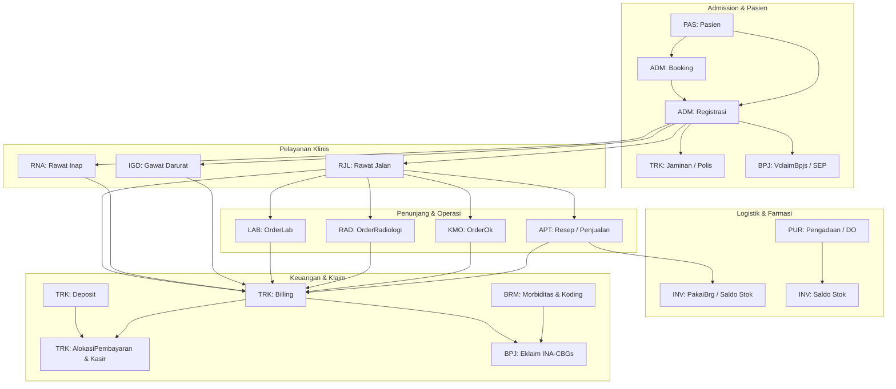

# MAPPING OUTCOME V2 KE DOMAIN DAN CAPABILITY
## Sistem Informasi Rumah Sakit (MyHosWeb)

| Dokumen | Referensi / Metadata |
|---|---|
| **Artifact** | `outcome-capability-domain-v2.md` |
| **Versi** | 2.1 |
| **Tanggal Pembaruan** | 2026-10-10 |
| **Status** | Canonical Mapping Approved |
| **Fondasi Konseptual** | [`foundation/conceptual-model.md`](file:///d:/Project.Aktif/b21-myhosweb-system/foundation/conceptual-model.md) |
| **Authoritative Catalogs** | [`domain/DOMAIN-CATALOG.md`](file:///d:/Project.Aktif/b21-myhosweb-system/domain/DOMAIN-CATALOG.md), [`outcomes/list-outcome-v2.md`](file:///d:/Project.Aktif/b21-myhosweb-system/outcomes/list-outcome-v2.md) |

---

## 1. Landasan & Prinsip Konseptual

Berdasarkan dokumen [`foundation/conceptual-model.md`](file:///d:/Project.Aktif/b21-myhosweb-system/foundation/conceptual-model.md), arsitektur fungsional MyHosWeb diatur oleh pemisahan semantik yang ketat:

```text
BUSINESS HIERARCHY:
Domain (Scope Boundary)
   ↓
Capability (Business Ability — milik tepat 1 Domain)
   ↓
Outcome (Persisted Current Business State — unit utama perubahan bisnis)
   ↓
Use Case (Interaction Scenario — cara aktor berinteraksi)
```

### Aturan Kunci Pemetaan:
1. **Business State Test (Rule 1)**: Outcome adalah fakta bisnis terkini yang tersimpan (*persisted current business state*), bukan entitas tabel basis data dan bukan operasi CRUD/antarmuka visual. Format konseptual: `<Entity> exists`.
2. **State Transition Test (Rule 2)**: Transisi siklus hidup operasional dari state yang sama merupakan *Use Case*, bukan Outcome baru.
3. **Cross-Domain Outcomes (Rule 4 & 9.5)**: Outcome tidak dibatasi oleh satu Domain. Suatu Outcome memiliki **Domain Pemilik Utama (Primary Owner)** dan dapat membutuhkan kontribusi kapabilitas dari **Contributing Domains** lain.
4. **Authoritative Domain Scope**: Domain Catalog mendefinisikan batas lingkup resmi (*system scope*). Kapabilitas yang belum tercatat secara formal diklasifikasikan sebagai *Existing but Undocumented* atau *Capability Candidate* dan memerlukan eskalasi ke Product Owner sesuai pohon keputusan tata kelola.

---

## 2. Struktur Domain & Kapabilitas Kanonikal

Sistem MyHosWeb memiliki **15 Domain Spesifikasi Utama** yang seluruhnya telah didukung oleh dokumen spesifikasi domain lengkap di direktori [`domain/`](file:///d:/Project.Aktif/b21-myhosweb-system/domain):

| No | Kode | Nama Domain | Ringkasan Tanggung Jawab Lingkup | Dokumen Spesifikasi |
|---|---|---|---|---|
| 01 | **PAS** | Pasien | Identitas, demografi, data sosial, dan resolusi duplikasi pasien | [`domain/01-PASIEN-DOMAIN.md`](file:///d:/Project.Aktif/b21-myhosweb-system/domain/01-PASIEN-DOMAIN.md) |
| 02 | **ORG** | Organisasi | Struktur unit layanan, instalasi, kamar/bed, PPA, dan jadwal praktik | [`domain/02-ORGANISASI-DOMAIN.md`](file:///d:/Project.Aktif/b21-myhosweb-system/domain/02-ORGANISASI-DOMAIN.md) |
| 03 | **ADM** | Admission | Pendaftaran kunjungan (RJ, RI, IGD), booking/appointment, dan journey tracking | [`domain/03-ADMISSION-DOMAIN.md`](file:///d:/Project.Aktif/b21-myhosweb-system/domain/03-ADMISSION-DOMAIN.md) |
| 04 | **RJL** | Rawat Jalan | Pelayanan klinis rawat jalan, konsultasi, pembebanan tindakan, dan antrean poli | [`domain/04-RAWAT-JALAN-DOMAIN.md`](file:///d:/Project.Aktif/b21-myhosweb-system/domain/04-RAWAT-JALAN-DOMAIN.md) |
| 05 | **RNA** | Rawat Inap | Siklus rawat inap, antrean bangsal, okupansi bed, transfer, room charge, dan discharge | [`domain/05-RAWAT-INAP-DOMAIN.md`](file:///d:/Project.Aktif/b21-myhosweb-system/domain/05-RAWAT-INAP-DOMAIN.md) |
| 06 | **IGD** | Gawat Darurat | Kunjungan gawat darurat, triase darurat, prosedur gawat darurat, dan ambulance | [`domain/06-GAWAT-DARURAT-DOMAIN.md`](file:///d:/Project.Aktif/b21-myhosweb-system/domain/06-GAWAT-DARURAT-DOMAIN.md) |
| 07 | **LAB** | Laboratory | Siklus pemeriksaan lab, order lab, registrasi eksternal, spesimen, dan hasil lab | [`domain/07-LABORATORY-DOMAIN.md`](file:///d:/Project.Aktif/b21-myhosweb-system/domain/07-LABORATORY-DOMAIN.md) |
| 08 | **RAD** | Radiology | Order radiologi, penjadwalan modalitas/alat fisik, pemeriksaan, dan ekspertise | [`domain/08-RADIOLOGI-DOMAIN.md`](file:///d:/Project.Aktif/b21-myhosweb-system/domain/08-RADIOLOGI-DOMAIN.md) |
| 09 | **KMO** | Kamar Operasi | Order bedah, jadwal kamar operasi, pre-op clearance, prosedur operasi, dan recovery | [`domain/09-KAMAR-OPERASI-DOMAIN.md`](file:///d:/Project.Aktif/b21-myhosweb-system/domain/09-KAMAR-OPERASI-DOMAIN.md) |
| 10 | **APT** | Apotek | Resep farmasi, telaah resep, antrean farmasi, penjualan, peracikan, dan serah obat | [`domain/10-APOTEK-DOMAIN.md`](file:///d:/Project.Aktif/b21-myhosweb-system/domain/10-APOTEK-DOMAIN.md) |
| 11 | **INV** | Inventory | Master barang, saldo stok per lokasi, pergerakan/mutasi, konsumsi, dan opname fisik | [`domain/11-INVENTORY-DOMAIN.md`](file:///d:/Project.Aktif/b21-myhosweb-system/domain/11-INVENTORY-DOMAIN.md) |
| 12 | **PUR** | Purchasing | Pengadaan logistik, supplier, material request, PO, penerimaan barang, dan invoice | [`domain/12-PURCHASING-DOMAIN.md`](file:///d:/Project.Aktif/b21-myhosweb-system/domain/12-PURCHASING-DOMAIN.md) |
| 13 | **TRK** | Tata Rekening | Master tarif, jaminan/payer, tagihan (billing), alokasi pembayaran, kasir, dan deposit | [`domain/13-TATA-REKENING.md`](file:///d:/Project.Aktif/b21-myhosweb-system/domain/13-TATA-REKENING.md) |
| 14 | **BRM** | Berkas Rekam Medis | Penomoran/mutasi fisik berkas, koding diagnosis (ICD-10/9), morbiditas, dan pelaporan RL | [`domain/14-BERKAS-REKAM-MEDIS.md`](file:///d:/Project.Aktif/b21-myhosweb-system/domain/14-BERKAS-REKAM-MEDIS.md) |
| 15 | **BPJ** | BPJS | Integrasi regulasi BPJS Kesehatan, penerbitan SEP (VClaim), dan pengajuan e-Klaim | [`domain/15-BPJS-DOMAIN.md`](file:///d:/Project.Aktif/b21-myhosweb-system/domain/15-BPJS-DOMAIN.md) |

---

## 3. Matriks Pemetaan Lengkap: Outcome V2 (51 Outcomes)

Berikut adalah pemetaan komprehensif ke-51 Outcome V2 dari [`outcomes/list-outcome-v2.md`](file:///d:/Project.Aktif/b21-myhosweb-system/outcomes/list-outcome-v2.md) ke Domain Pemilik Utama, Kapabilitas Utama, Kapabilitas Kontributor, dan Status Kapabilitas.

> **Status Dokumen Definisi Formal (`outcomes/OC-*.md`):**
> - 🟢 **Tersedia (40 Outcomes)**: Telah memiliki dokumen spesifikasi formal mandiri di direktori [`outcomes/`](file:///d:/Project.Aktif/b21-myhosweb-system/outcomes).
> - ⚪ **Belum Tersedia (11 Outcomes)**: Belum memiliki dokumen spesifikasi formal mandiri (terpetakan secara arsitektural pada domain & kapabilitas terkait).

| No | Outcome V2 | Dokumen Definisi Formal | Semantic Business State (`<Entity> exists`) | Primary Domain | Primary Capability | Contributing Domains & Capabilities | Status Kapabilitas |
|---|---|---|---|---|---|---|---|
| 1 | **AlokasiPembayaran** | 🟢 [`OC-TRK-ALOKASI-PEMBAYARAN.md`](file:///d:/Project.Aktif/b21-myhosweb-system/outcomes/OC-TRK-ALOKASI-PEMBAYARAN.md) | *Payment Settlement Allocation exists* | **TRK** (Tata Rekening) | `TRK-PAYMENT` Payment & `TRK-ALOKASI` | `TRK-BILLING`, `TRK-JAMINAN` (Polis Penjamin), `TRK-KASIR`, `TRK-DEPOSIT` | Known |
| 2 | **Ambulance** | 🟢 [`OC-IGD-AMBULANCE.md`](file:///d:/Project.Aktif/b21-myhosweb-system/outcomes/OC-IGD-AMBULANCE.md) | *Ambulance Usage & Charge exists* | **IGD** (Gawat Darurat) | `IGD-AMBULANCE` Ambulance | `TRK-TARIF` (Tarif Layanan/Jarak/Wilayah), `PAS-DATSOS` (Identitas Pasien), `ORG-PPA` (Supir/Petugas Medis), `ADM-REG`, `TRK-BILLING`, `TRK-JAMINAN`, `BPJ-VCLAIM` | Known |
| 3 | **Antrian** | 🟢 [`OC-ADM-ANTRIAN.md`](file:///d:/Project.Aktif/b21-myhosweb-system/outcomes/OC-ADM-ANTRIAN.md) | *Queue Ticket & Call State exists* | **ADM** (Admission) / **RJL** (Rawat Jalan) | `ADM-ANTRIAN` Antrian Registrasi & `RJL-ANTRIAN` Antrian Poli | `PAS-DATSOS` (Identitas Pasien), `ORG-LAYANAN` (Unit Poli Tujuan) | Known |
| 4 | **AntrianApotek** | 🟢 [`OC-APT-ANTRIAN-APOTEK.md`](file:///d:/Project.Aktif/b21-myhosweb-system/outcomes/OC-APT-ANTRIAN-APOTEK.md) | *Pharmacy Queue Ticket exists* | **APT** (Apotek) | `APT-QUEUE` Antrian Apotek | `PAS-DATSOS` (Pasien), `ADM-REG` (Kunjungan Aktif) | Known |
| 5 | **Billing** | 🟢 [`OC-TRK-BILLING.md`](file:///d:/Project.Aktif/b21-myhosweb-system/outcomes/OC-TRK-BILLING.md) | *Patient Account & Charge Items exist* | **TRK** (Tata Rekening) | `TRK-BILLING` Billing | `TRK-TARIF`, `TRK-JAMINAN`, `RJL-TINDAKAN`, `RNA-TINDAKAN`, `RNA-CHARGE`, `IGD-TINDAKAN`, `LAB-ORDER`, `RAD-ORDER`, `KMO-OPR`, `APT-BILL` | Known |
| 6 | **Booking** | 🟢 [`OC-ADM-BOOKING.md`](file:///d:/Project.Aktif/b21-myhosweb-system/outcomes/OC-ADM-BOOKING.md) | *Patient Appointment / Booking exists* | **ADM** (Admission) | `ADM-BOOKING` Booking | `PAS-DATSOS` (Identitas Pasien), `ORG-JADWAL` (Jadwal Praktek Dokter), `ORG-LAYANAN` (Poliklinik/Unit Layanan), `ORG-PPA` (Dokter Spesialis) | Known |
| 7 | **ClosingShift** | 🟢 [`OC-TRK-CLOSING-SHIFT.md`](file:///d:/Project.Aktif/b21-myhosweb-system/outcomes/OC-TRK-CLOSING-SHIFT.md) | *Cashier Shift Closing exists* | **TRK** (Tata Rekening) | `TRK-KASIR` Kasir | `ORG-PPA` (Petugas Kasir), `ORG-LAYANAN` (Loket Kasir) | Known |
| 8 | **DataSosialPasien** | 🟢 [`OC-PAS-DATA-SOSIAL-PASIEN.md`](file:///d:/Project.Aktif/b21-myhosweb-system/outcomes/OC-PAS-DATA-SOSIAL-PASIEN.md) | *Patient Master Social Data exists* | **PAS** (Pasien) | `PAS-DATSOS` Data Sosial Pasien | `PAS-MERGE` (Resolusi Duplikasi Pasien) | Known |
| 9 | **Deposit** | 🟢 [`OC-TRK-DEPOSIT.md`](file:///d:/Project.Aktif/b21-myhosweb-system/outcomes/OC-TRK-DEPOSIT.md) | *Patient Financial Deposit Balance exists* | **TRK** (Tata Rekening) | `TRK-DEPOSIT` Deposit | `TRK-KASIR` (Penerimaan Kasir), `TRK-PAYMENT` (Alokasi Pembayaran), `ADM-REG` (Kunjungan Aktif), `PAS-DATSOS` (Identitas Pasien) | Known |
| 10 | **Eklaim** | ⚪ *Belum Tersedia* | *BPJS INA-CBGs Claim Package exists* | **BPJ** (BPJS) | `BPJ-EKLAIM` e-Klaim | `BRM-CODING` (ICD-10/9-CM), `BRM-MORBID`, `TRK-BILLING` (Biaya Riil RS), `TRK-JAMINAN`, `ADM-REG` | Known (Catalog) |
| 11 | **Expertise** | ⚪ *Belum Tersedia* | *Radiology Expertise Report exists* | **RAD** (Radiologi) | `RAD-EXPERTISE` Expertise | `RAD-EXAM` (Hasil Citra Modalitas), `ORG-PPA` (Dokter Spesialis Radiologi), `PAS-DATSOS` | Known |
| 12 | **Faktur** | ⚪ *Belum Tersedia* | *Supplier Invoice exists* | **PUR** (Purchasing) | `PUR-FAKTUR` Faktur | `PUR-PO` (Pesanan Pembelian), `PUR-DO` (Tanda Terima Fisik), `PUR-SUPPLIER` | Known |
| 13 | **Forecasting** | ⚪ *Belum Tersedia* | *Procurement Forecast Plan exists* | **PUR** (Purchasing) | `PUR-FORECAST` Procurement Forecasting | `INV-STOK` (Saldo Berjalan), `INV-PAKAI` (Tren Historis Konsumsi) | Known |
| 14 | **HasilLab** | 🟢 [`OC-LAB-HASIL-LAB.md`](file:///d:/Project.Aktif/b21-myhosweb-system/outcomes/OC-LAB-HASIL-LAB.md) | *Validated Laboratory Result exists* | **LAB** (Laboratory) | `LAB-RESULT` Lab Result Management | `LAB-COLLECT` (Spesimen), `LAB-ORDER`, `ORG-PPA` (Analis Lab / Patolog Klinis), `TRK-BILLING` | Known |
| 15 | **IgdTriage** | 🟢 [`OC-IGD-TRIAGE.md`](file:///d:/Project.Aktif/b21-myhosweb-system/outcomes/OC-IGD-TRIAGE.md) | *Emergency Triage Assessment exists* | **IGD** (Gawat Darurat) | `IGD-TRIAGE` Triage | `IGD-VISIT`, `ORG-PPA` (Dokter/Perawat Triase), `PAS-DATSOS`, `ADM-REG` | Known |
| 16 | **IgdVisit** | 🟢 [`OC-IGD-VISIT.md`](file:///d:/Project.Aktif/b21-myhosweb-system/outcomes/OC-IGD-VISIT.md) | *Emergency Visit exists* | **IGD** (Gawat Darurat) | `IGD-VISIT` IGD Visit | `PAS-DATSOS`, `ADM-REG` (Asosiasi Registrasi Administratif Lanjutan), `ORG-PPA`, `ORG-LAYANAN`, `IGD-TRIAGE`, `IGD-TINDAKAN`, `TRK-BILLING` | Known |
| 17 | **JadwalOk** | 🟢 [`OC-KMO-JADWAL-OK.md`](file:///d:/Project.Aktif/b21-myhosweb-system/outcomes/OC-KMO-JADWAL-OK.md) | *Surgical Operating Schedule exists* | **KMO** (Kamar Operasi) | `KMO-JADWAL` Jadwal Operasi | `KMO-ORDER`, `ORG-LAYANAN` (Kamar Bedah), `ORG-PPA` (Operator, Anestesi, Perawat Asisten) | Known |
| 18 | **JadwalPraktek** | 🟢 [`OC-ORG-JADWAL-PRAKTEK.md`](file:///d:/Project.Aktif/b21-myhosweb-system/outcomes/OC-ORG-JADWAL-PRAKTEK.md) | *Doctor Outpatient Schedule exists* | **ORG** (Organisasi) | `ORG-JADWAL` Jadwal Praktek Dokter | `ORG-LAYANAN` (Klinik/Poli), `ORG-PPA` (Dokter Spesialis) | Known |
| 19 | **JadwalRadiologi** | ⚪ *Belum Tersedia* | *Radiology Machine Schedule exists* | **RAD** (Radiologi) | `RAD-JADWAL` Jadwal Radiologi | `RAD-ORDER`, `ORG-LAYANAN` (Ruang/Modalitas Radiologi) | Known |
| 20 | **Kasir** | 🟢 [`OC-TRK-KASIR.md`](file:///d:/Project.Aktif/b21-myhosweb-system/outcomes/OC-TRK-KASIR.md) | *Cash Receipt / Disbursement exists* | **TRK** (Tata Rekening) | `TRK-KASIR` Kasir | `TRK-BILLING`, `TRK-PAYMENT`, `TRK-DEPOSIT`, `PAS-DATSOS` | Known |
| 21 | **MaterialReq** | 🟢 [`OC-PUR-MATERIAL-REQ.md`](file:///d:/Project.Aktif/b21-myhosweb-system/outcomes/OC-PUR-MATERIAL-REQ.md) | *Internal Material Request exists* | **PUR** (Purchasing) | `PUR-MATREQ` Material Request | `ORG-LAYANAN` (Unit Kerja Pemohon) | Known |
| 22 | **MorbiditasPasien** | ⚪ *Belum Tersedia* | *Patient Clinical Morbidity Record exists* | **BRM** (Berkas Rekam Medis) | `BRM-MORBID` Morbiditas Pasien | `BRM-CODING` (Diagnosis Kodifikasi), `PAS-DATSOS`, `RJL-KONSUL` / `RNA-DISCHARGE` | Known (Catalog) |
| 23 | **Mutasi** | 🟢 [`OC-INV-MUTASI.md`](file:///d:/Project.Aktif/b21-myhosweb-system/outcomes/OC-INV-MUTASI.md) | *Stock Dispatch / Mutation exists* | **INV** (Inventory) | `INV-MUTASI` Mutasi | `INV-STOK`, `INV-MASTER`, `ORG-LAYANAN` (Gudang Asal & Gudang Tujuan) | Known |
| 24 | **MutasiBerkas** | 🟢 [`OC-BRM-MUTASI-BERKAS.md`](file:///d:/Project.Aktif/b21-myhosweb-system/outcomes/OC-BRM-MUTASI-BERKAS.md) | *Medical Record Physical Movement exists* | **BRM** (Berkas Rekam Medis) | `BRM-MUTASI` Mutasi Berkas | `PAS-DATSOS` (Nomor RM Pasien), `ORG-LAYANAN` (Lokasi Peminjam/Pemegang Berkas) | Known (Catalog) |
| 25 | **OrderDispensing** | 🟢 [`OC-APT-ORDER-DISPENSING.md`](file:///d:/Project.Aktif/b21-myhosweb-system/outcomes/OC-APT-ORDER-DISPENSING.md) | *Pharmacy Dispensing Allocation exists* | **APT** (Apotek) | `APT-DISPENSING` Dispensing | `APT-ORDER`, `APT-SERAH`, `INV-PAKAI` (Pengurangan Stok Obat/Alkes) | Known |
| 26 | **OrderLab** | 🟢 [`OC-LAB-ORDER-LAB.md`](file:///d:/Project.Aktif/b21-myhosweb-system/outcomes/OC-LAB-ORDER-LAB.md) | *Laboratory Examination Order exists* | **LAB** (Laboratory) | `LAB-ORDER` Order Lab | `RJL-KONSUL` / `RNA-TRANSFER` / `IGD-VISIT` (Konteks Pengorder), `PAS-DATSOS`, `ORG-PPA`, `ORG-LAYANAN`, `TRK-BILLING` | Known |
| 27 | **OrderOk** | 🟢 [`OC-KMO-ORDER-OK.md`](file:///d:/Project.Aktif/b21-myhosweb-system/outcomes/OC-KMO-ORDER-OK.md) | *Surgical Operation Order exists* | **KMO** (Kamar Operasi) | `KMO-ORDER` Order Operasi | `RJL-KONSUL` / `RNA-TRANSFER` / `IGD-VISIT` (Klinisi Pengorder), `PAS-DATSOS` | Known |
| 28 | **OrderRadiologi** | ⚪ *Belum Tersedia* | *Radiology Order exists* | **RAD** (Radiologi) | `RAD-ORDER` Order Radiologi | `RJL-KONSUL` / `RNA-TRANSFER` / `IGD-VISIT` (Klinisi Pengorder), `PAS-DATSOS` | Known |
| 29 | **PakaiBed** | 🟢 [`OC-RNA-PAKAI-BED.md`](file:///d:/Project.Aktif/b21-myhosweb-system/outcomes/OC-RNA-PAKAI-BED.md) | *Inpatient Bed Occupancy exists* | **RNA** (Rawat Inap) | `RNA-BED` Pakai Bed | `ORG-BANGSAL` (Master Kamar & Bed), `ADM-REG` (Kunjungan Ranap), `PAS-DATSOS` | Known |
| 30 | **PakaiBrg** | 🟢 [`OC-INV-PAKAI-BRG.md`](file:///d:/Project.Aktif/b21-myhosweb-system/outcomes/OC-INV-PAKAI-BRG.md) | *Inventory Consumption exists* | **INV** (Inventory) | `INV-PAKAI` Pakai Barang | `INV-STOK`, `INV-MASTER`, `ORG-LAYANAN` (Unit Pengguna / Cost Center), `ORG-PPA` | Known |
| 31 | **PasienTracker** | 🟢 [`OC-ADM-PASIEN-TRACKER.md`](file:///d:/Project.Aktif/b21-myhosweb-system/outcomes/OC-ADM-PASIEN-TRACKER.md) | *Patient Journey Step exists* | **ADM** (Admission) | `ADM-TRACKER` Pasien Journey | Seluruh Unit Pelayanan (RJL, RNA, IGD, LAB, RAD, APT), `PAS-DATSOS` | Known |
| 32 | **PelaporanRL** | 🟢 [`OC-BRM-PELAPORAN-RL.md`](file:///d:/Project.Aktif/b21-myhosweb-system/outcomes/OC-BRM-PELAPORAN-RL.md) | *Ministry Health RL Report exists* | **BRM** (Berkas Rekam Medis) | `BRM-RL` Laporan RL | `BRM-CODING`, `BRM-MORBID`, `BRM-INDIKATOR` (BOR/LOS/TOI), `ORG-GOVERNANCE` (`LayananDk`) | Known (Catalog) |
| 33 | **Penjualan** | 🟢 [`OC-APT-PENJUALAN.md`](file:///d:/Project.Aktif/b21-myhosweb-system/outcomes/OC-APT-PENJUALAN.md) | *Pharmacy Sales Bill exists* | **APT** (Apotek) | `APT-BILL` Sales Bill & `APT-ORDER` | `TRK-BILLING`, `TRK-TARIF`, `PAS-DATSOS` | Known |
| 34 | **PreOperativeClearance** | 🟢 [`OC-KMO-PREOP-CLEARANCE.md`](file:///d:/Project.Aktif/b21-myhosweb-system/outcomes/OC-KMO-PREOP-CLEARANCE.md) | *Pre-Operative Readiness / Clearance exists* | **KMO** (Kamar Operasi) | `KMO-PREOP` Persiapan Operasi | `KMO-ORDER`, `KMO-JADWAL`, `PAS-DATSOS`, `ADM-REG`, `ORG-PPA` | Known |
| 35 | **PurchaseOrder** | 🟢 [`OC-PUR-PURCHASE-ORDER.md`](file:///d:/Project.Aktif/b21-myhosweb-system/outcomes/OC-PUR-PURCHASE-ORDER.md) | *Purchase Order exists* | **PUR** (Purchasing) | `PUR-PO` Purchase Order | `PUR-PURREQ`, `PUR-SUPPLIER`, `ORG-LAYANAN` | Known |
| 36 | **PurchaseReq** | 🟢 [`OC-PUR-PURCHASE-REQ.md`](file:///d:/Project.Aktif/b21-myhosweb-system/outcomes/OC-PUR-PURCHASE-REQ.md) | *Purchase Request exists* | **PUR** (Purchasing) | `PUR-PURREQ` Purchase Request | `PUR-MATREQ`, `PUR-FORECAST` | Known |
| 37 | **RegExternal** | 🟢 [`OC-LAB-REG-EXTERNAL.md`](file:///d:/Project.Aktif/b21-myhosweb-system/outcomes/OC-LAB-REG-EXTERNAL.md) | *Direct External Lab Registration exists* | **LAB** (Laboratory) | `LAB-EXTERNAL` Registrasi External | `TRK-BILLING`, `TRK-TARIF`, `TRK-KASIR`, `LAB-ORDER` | Known |
| 38 | **Registrasi** | 🟢 [`OC-ADM-REGISTRASI.md`](file:///d:/Project.Aktif/b21-myhosweb-system/outcomes/OC-ADM-REGISTRASI.md) | *Hospital Service Registration exists* | **ADM** (Admission) | `ADM-REG` Registration | `PAS-DATSOS`, `ORG-LAYANAN`, `ORG-PPA`, `ORG-JADWAL`, `ORG-BANGSAL`, `IGD-VISIT`, `RNA-WAITLIST`, `LAB-EXTERNAL`, `TRK-JAMINAN`, `TRK-TARIF`, `TRK-DEPOSIT`, `BPJ-VCLAIM` | Known |
| 39 | **ReqMutasi** | 🟢 [`OC-INV-REQ-MUTASI.md`](file:///d:/Project.Aktif/b21-myhosweb-system/outcomes/OC-INV-REQ-MUTASI.md) | *Stock Transfer Request exists* | **INV** (Inventory) | `INV-MUTASI` Mutasi (Tahap 1: ReqMutasi) | `ORG-LAYANAN` (Unit Pemohon & Unit Penyedia), `INV-STOK`, `INV-MASTER` | Known |
| 40 | **ReturBeli** | ⚪ *Belum Tersedia* | *Purchase Return exists* | **PUR** (Purchasing) | `PUR-RETURN` Purchase Return | `PUR-DO`, `PUR-SUPPLIER`, `INV-MUTASI` (Pengurangan Fisik Stok) | Known |
| 41 | **RoomCharge** | 🟢 [`OC-RNA-ROOM-CHARGE.md`](file:///d:/Project.Aktif/b21-myhosweb-system/outcomes/OC-RNA-ROOM-CHARGE.md) | *Calculated Room Charge exists* | **RNA** (Rawat Inap) | `RNA-CHARGE` Room Charge | `RNA-BED` (Durasi & Perpindahan Bed), `TRK-TARIF` (Tarif Dasar Kamar), `TRK-BILLING` | Known |
| 42 | **SampleCollection** | 🟢 [`OC-LAB-SAMPLE-COLLECTION.md`](file:///d:/Project.Aktif/b21-myhosweb-system/outcomes/OC-LAB-SAMPLE-COLLECTION.md) | *Specimen Sample Record exists* | **LAB** (Laboratory) | `LAB-COLLECT` Specimen Collection | `LAB-ORDER`, `ORG-PPA` (Petugas Flebotomi/Analis), `PAS-DATSOS` | Known |
| 43 | **SensusIndex** | 🟢 [`OC-BRM-SENSUS-INDEX.md`](file:///d:/Project.Aktif/b21-myhosweb-system/outcomes/OC-BRM-SENSUS-INDEX.md) | *Service Census & Case Index exists* | **BRM** (Berkas Rekam Medis) | `BRM-RPT` Sensus dan Index | `BRM-CODING`, `BRM-MORBID`, `BRM-INDIKATOR`, `ADM-REG`, `ADM-TRACKER`, `RNA-BED`, `RNA-DISCHARGE`, `RJL-KONSUL`, `IGD-VISIT`, `PAS-DATSOS`, `ORG-BANGSAL`, `TRK-JAMINAN` | Known (Catalog) |
| 44 | **Stok** | 🟢 [`OC-INV-STOK.md`](file:///d:/Project.Aktif/b21-myhosweb-system/outcomes/OC-INV-STOK.md) | *Inventory Stock Level exists* | **INV** (Inventory) | `INV-STOK` Stok | `INV-MASTER`, `ORG-LAYANAN` (Lokasi Gudang/Depo) | Known |
| 45 | **StokOpname** | ⚪ *Belum Tersedia* | *Physical Stock Reconciliation exists* | **INV** (Inventory) | `INV-OPNAME` Stok Opname | `INV-STOK`, `INV-MASTER`, `ORG-LAYANAN` | Known |
| 46 | **TelaahResep** | 🟢 [`OC-APT-TELAAH-RESEP.md`](file:///d:/Project.Aktif/b21-myhosweb-system/outcomes/OC-APT-TELAAH-RESEP.md) | *Pharmacist Clinical Review exists* | **APT** (Apotek) | `APT-TELAAH` Telaah Resep | `APT-RESEP`, `ORG-PPA` (Apoteker Penelaah) | Known |
| 47 | **TerimaBrg** | ⚪ *Belum Tersedia* | *Goods Receipt (DO) Record exists* | **PUR** (Purchasing) | `PUR-DO` DO Penerimaan Barang | `PUR-PO`, `PUR-SUPPLIER`, `INV-MUTASI` / `INV-STOK` (Pencatatan Masuk Fisik) | Known |
| 48 | **TerimaMutasi** | 🟢 [`OC-INV-TERIMA-MUTASI.md`](file:///d:/Project.Aktif/b21-myhosweb-system/outcomes/OC-INV-TERIMA-MUTASI.md) | *Stock Transfer Acceptance exists* | **INV** (Inventory) | `INV-MUTASI` Mutasi (Tahap 3: TerimaMutasi) | `INV-STOK`, `INV-MASTER`, `ORG-LAYANAN` (Gudang Penerima) | Known |
| 49 | **Tindakan** | ⚪ *Belum Tersedia* | *Patient Procedure Charge Record exists* | **TRK** (Tata Rekening) | `TRK-BILLING` Billing (Item Tagihan Tindakan) | `RJL-TINDAKAN` (Rawat Jalan), `RNA-TINDAKAN` (Rawat Inap), `IGD-TINDAKAN` (Gawat Darurat), `TRK-TARIF` (Tarif Tindakan), `ORG-PPA` (Pelaksana Klinis), `PAS-DATSOS` (Identitas Pasien) | Known |
| 50 | **VclaimBpjs** | 🟢 [`OC-BPJ-VCLAIM.md`](file:///d:/Project.Aktif/b21-myhosweb-system/outcomes/OC-BPJ-VCLAIM.md) | *BPJS Participation & SEP exists* | **BPJ** (BPJS) | `BPJ-VCLAIM` VClaim | `ADM-REG`, `TRK-JAMINAN`, `PAS-DATSOS` | Known (Catalog) |
| 51 | **WaitingList** | 🟢 [`OC-RNA-WAITING-LIST.md`](file:///d:/Project.Aktif/b21-myhosweb-system/outcomes/OC-RNA-WAITING-LIST.md) | *Inpatient Bed Waiting Queue exists* | **RNA** (Rawat Inap) | `RNA-WAITLIST` Waiting List | `ADM-REG` (Rekomendasi Ranap), `ORG-BANGSAL` (Ketersediaan Kamar), `PAS-DATSOS`, `RNA-TRANSFER`, `RNA-BED` | Known |

---

## 4. Distribusi Outcome Berdasarkan Primary Domain

Berikut adalah ringkasan pengelompokan ke-51 Outcome berdasarkan Domain Pemilik Utama (*Primary Owner*) serta status ketersediaan dokumen spesifikasi formal (`OC-*.md`):

```text
┌──────────────────────────────────────┬─────────────┬────────────────┬────────────────────────────────────────────────────────┐
│ Domain Pemilik Utama (Primary Owner) │ Jml Outcome │ Formal Defined │ Daftar Outcome V2 & Status Formal                      │
├──────────────────────────────────────┼─────────────┼────────────────┼────────────────────────────────────────────────────────┤
│ 01. PASIEN (PAS)                     │      1      │    1 (100%)    │ DataSosialPasien 🟢                                    │
│ 02. ORGANISASI (ORG)                 │      1      │    1 (100%)    │ JadwalPraktek 🟢                                       │
│ 03. ADMISSION (ADM)                  │      4      │    4 (100%)    │ Antrian (Loket)* 🟢, Booking 🟢, PasienTracker 🟢,      │
│                                      │             │                │ Registrasi 🟢                                          │
│ 04. RAWAT JALAN (RJL)                │      1      │    1 (100%)    │ Antrian (Poli)* 🟢                                     │
│ 05. RAWAT INAP (RNA)                 │      3      │    3 (100%)    │ PakaiBed 🟢, RoomCharge 🟢, WaitingList 🟢               │
│ 06. GAWAT DARURAT (IGD)              │      3      │   3 (100%)     │ Ambulance 🟢, IgdTriage 🟢, IgdVisit 🟢                  │
│ 07. LABORATORY (LAB)                 │      4      │    4 (100%)    │ HasilLab 🟢, OrderLab 🟢, RegExternal 🟢,                │
│                                      │             │                │ SampleCollection 🟢                                    │
│ 08. RADIOLOGY (RAD)                  │      3      │    0 (0%)      │ Expertise ⚪, JadwalRadiologi ⚪, OrderRadiologi ⚪      │
│ 09. KAMAR OPERASI (KMO)              │      3      │   3 (100%)     │ JadwalOk 🟢, OrderOk 🟢, PreOperativeClearance 🟢        │
│ 10. APOTEK (APT)                     │      4      │   4 (100%)     │ AntrianApotek 🟢, OrderDispensing 🟢, Penjualan 🟢,       │
│                                      │             │                │ TelaahResep 🟢                                          │
│ 11. INVENTORY (INV)                  │      6      │    5 (83%)     │ Mutasi 🟢, ReqMutasi 🟢, TerimaMutasi 🟢,             │
│                                      │             │                │ PakaiBrg 🟢, Stok 🟢, StokOpname ⚪                           │
│ 12. PURCHASING (PUR)                 │      7      │    3 (43%)     │ MaterialReq 🟢, PurchaseReq 🟢, PurchaseOrder 🟢,        │
│                                      │             │                │ Faktur ⚪, Forecasting ⚪, ReturBeli ⚪, TerimaBrg ⚪      │
│ 13. TATA REKENING (TRK)              │      6      │    5 (83%)     │ AlokasiPembayaran* 🟢, Billing 🟢, ClosingShift 🟢,     │
│                                      │             │                │ Deposit 🟢, Kasir 🟢, Tindakan ⚪                        │
│ 14. BERKAS REKAM MEDIS (BRM)         │      4      │    3 (75%)     │ MorbiditasPasien ⚪, MutasiBerkas 🟢, PelaporanRL 🟢,    │
│                                      │             │                │ SensusIndex 🟢                                         │
│ 15. BPJS (BPJ)                       │      2      │    1 (50%)     │ Eklaim ⚪, VclaimBpjs 🟢                                │
├──────────────────────────────────────┼─────────────┼────────────────┼────────────────────────────────────────────────────────┤
│ TOTAL                                │     51      │   40 (78.4%)   │ 🟢 40 Formal Defined  │  ⚪ 11 Pending Formal Definition│
└──────────────────────────────────────┴─────────────┴────────────────┴────────────────────────────────────────────────────────┘
```
*\*Catatan: `AlokasiPembayaran` secara kanonikal mensupersede label sementara `OrderPayment` dari draf awal V2 agar selaras dengan berkas spesifikasi OC-TRK-ALOKASI-PEMBAYARAN.md. `Antrian` mencakup antrean pendaftaran loket (`ADM-ANTRIAN`) dan antrean pelayanan poli (`RJL-ANTRIAN`). `Tindakan` dipetakan sebagai satu shared outcome tunggal ('Patient Procedure Charge Record exists') dengan kepemilikan utama kanonikal di Tata Rekening (`TRK`) karena secara esensi bisnis entitas ini merepresentasikan pembebanan biaya finansial pasien (`TRK-BILLING`), sedangkan domain pelayanan klinis (`RJL-TINDAKAN`, `RNA-TINDAKAN`, `IGD-TINDAKAN`) bertindak sebagai kapabilitas kontributor pencatatan di titik layanan (point-of-care capture). Lihat Bagian 6 poin 4 untuk analisis tata kelola penetapan kepemilikan.*

---

## 5. Analisis Hubungan Lintas Domain (Cross-Domain Interactions)

Sesuai Prinsip Konseptual Bab 4.4 (*Cross-Domain Outcomes*), sebuah Outcome dapat memerlukan kapabilitas dari berbagai domain:



### 1. Rantai Pendapatan & Pembebanan Biaya (*Billing Chain*)
- **`Billing` (TRK)** mengonsumsi data dari seluruh unit pelaksana: `RJL-TINDAKAN`, `RNA-TINDAKAN`, `IGD-TINDAKAN`, `RNA-CHARGE`, `LAB-RESULT`/`LAB-ORDER`, `RAD-ORDER`, `KMO-OPR`, dan `APT-BILL`.
- **`RoomCharge` (RNA)** menghitung lamanya inap dan aturan sewa kamar secara operasional berdasarkan okupansi tempat tidur (`RNA-BED`), lalu mengalikan tarif dasar dari Tata Rekening (`TRK-TARIF`) untuk membentuk rincian tagihan (`TRK-BILLING`).
- **`Tindakan` (TRK)** merekam pembebanan tindakan administratif sebagai item tagihan finansial (`TRK-BILLING`) yang bersumber dari encounter rawat jalan (`RJL-TINDAKAN`), bangsal rawat inap (`RNA-TINDAKAN`), maupun gawat darurat (`IGD-TINDAKAN`), dengan penerapan tarif dasar dari `TRK-TARIF`.
- **`Deposit` (TRK)** memelihara uang jaminan finansial pasien yang disetorkan via kasir (`TRK-KASIR`), yang dialokasikan sebagai pembayaran pelunasan tagihan melalui **`AlokasiPembayaran` (TRK)** atau dikembalikan (refund) jika terdapat kelebihan.
- **`AlokasiPembayaran` (TRK)** mencatat dan mempersistensi seluruh penyelesaian kewajiban finansial atas tagihan (dari penerimaan kasir, klaim penjamin, maupun pemakaian deposit) hingga saldo tagihan terverifikasi lunas atau menyisakan piutang resmi.

### 2. Rantai Integrasi Pelayanan & Penunjang (*Diagnostic & Surgical Orders*)
- Permintaan penunjang (`OrderLab`, `OrderRadiologi`, `OrderOk`) dipicu dari encounter klinis (Rawat Jalan, Rawat Inap, atau IGD), tetapi kepemilikan siklus layanannya berada pada domain penunjang terkait.
- `PreOperativeClearance` (KMO) bertindak sebagai gerbang kesiapan operasi yang memverifikasi data pra-bedah termasuk hasil dari `HasilLab` (LAB) dan `Expertise` (RAD).

### 3. Rantai Logistik & Pengadaan (*Inventory & Procurement Chain*)
- Permintaan pengadaan bermula dari kebutuhan operasional `MaterialReq` (PUR), dikonsolidasikan dalam `PurchaseReq` (PUR), dipesan melalui `PurchaseOrder` (PUR), dan diterima secara fisik via `TerimaBrg` (PUR-DO).
- Penerimaan barang fisik dan retur beli langsung memperbarui saldo fisik barang di `Stok` (INV) melalui transaksi `Mutasi` (INV-MUTASI).
- Konsumsi harian di bangsal/poli/farmasi dicatat sebagai `PakaiBrg` (INV-PAKAI) yang memotong `Stok` (INV) dan dibebankan sebagai beban operasional unit (*Cost Center*).

### 4. Rantai Regulasi & Penjaminan (*BPJS & SIRS Chain*)
- Pendaftaran pasien berpenjaminan BPJS menciptakan `Registrasi` (ADM), diverifikasi keabsahannya dengan menerbitkan `VclaimBpjs` (BPJ-VCLAIM).
- Di akhir episode perawatan, data diagnosis dikodifikasi (`BRM-CODING` & `BRM-MORBID`), digabungkan dengan tagihan riil rumah sakit (`TRK-BILLING`) untuk membentuk berkas klaim digital `Eklaim` (BPJ-EKLAIM).
- Seluruh data agregat pelayanan, mobilitas rekam medis, dan statistik morbiditas dikompilasi ke dalam `PelaporanRL` (BRM-RL) untuk kepatuhan SIRS Kementerian Kesehatan, didukung oleh **`SensusIndex` (BRM-RPT)** yang menyediakan audit granular, penelusuran fakta (*drill-down*), serta indikator efisiensi pelayanan rumah sakit (BOR, ALOS, TOI).

### 5. Rantai Janji Temu & Admisi (*Appointment & Admission Chain*)
- **`Booking` (ADM)** mencatat reservasi janji temu pasien dengan dokter (`ORG-JADWAL` & `ORG-PPA`) sebelum hari kunjungan, yang kemudian digunakan sebagai basis pemanggilan dan penciptaan **`Registrasi` (ADM)** saat pasien tiba.

---

## 6. Status Tata Kelola & Keputusan Arsitektur Kanonikal (Ratified)

Seluruh poin telaah tata kelola konseptual yang diatur dalam [`foundation/conceptual-model.md`](file:///d:/Project.Aktif/b21-myhosweb-system/foundation/conceptual-model.md) telah **terpenuhi dan diresmikan (ratified)**:

1. **Kapabilitas `Forecasting` (`PUR-FORECAST`)**:
   - *Status*: **Terpenuhi & Terdaftar Resmi** di [`domain/12-PURCHASING-DOMAIN.md`](file:///d:/Project.Aktif/b21-myhosweb-system/domain/12-PURCHASING-DOMAIN.md) dan [`domain/DOMAIN-CATALOG.md`](file:///d:/Project.Aktif/b21-myhosweb-system/domain/DOMAIN-CATALOG.md).
   - Menghasilkan estimasi kebutuhan material pengadaan tanpa menggeser otoritas `Inventory` atas saldo stok fisik.

2. **Dekomposisi Mutasi Tiga Tahap (`ReqMutasi`, `Mutasi`, `TerimaMutasi`)**:
   - *Status*: **Terpenuhi & Terdaftar Resmi** di [`domain/11-INVENTORY-DOMAIN.md`](file:///d:/Project.Aktif/b21-myhosweb-system/domain/11-INVENTORY-DOMAIN.md) dan Matriks Section 3.
   - Menegakkan tiga fakta bisnis persisten independen: permintaan mutasi (`ReqMutasi`), pengeluaran fisik barang dalam transit (`Mutasi`), dan penerimaan verifikasi kuantitas di gudang tujuan (`TerimaMutasi`).

3. **Status Domain Berkas Rekam Medis (BRM) & BPJS (BPJ)**:
   - *Status*: **Terpenuhi**. Dokumen spesifikasi formal telah lengkap tersedia pada [`domain/14-BERKAS-REKAM-MEDIS.md`](file:///d:/Project.Aktif/b21-myhosweb-system/domain/14-BERKAS-REKAM-MEDIS.md) dan [`domain/15-BPJS-DOMAIN.md`](file:///d:/Project.Aktif/b21-myhosweb-system/domain/15-BPJS-DOMAIN.md), menyetarakan ke-15 domain spesifikasi sistem MyHosWeb.

4. **Kepemilikan Utama Definitif Outcome Tindakan**:
   - *Status*: **Diresmikan (Ratified)**. Tata Rekening (**TRK**) ditetapkan secara definitif sebagai Primary Domain kanonikal untuk Outcome `Tindakan` (`TRK-BILLING` Item Tagihan Prosedur) karena fakta bisnis persisten yang dibentuk adalah kewajiban keuangan pasien, dengan unit layanan klinis (`RJL-TINDAKAN`, `RNA-TINDAKAN`, `IGD-TINDAKAN`) bertindak sebagai kapabilitas kontributor pencatatan di titik layanan (*point-of-care capture*).

5. **Konsolidasi Unified Registrasi**:
   - *Status*: **Terpenuhi & Kanonikal**. Konsep registrasi tunggal lintas layanan (RJ, IGD, Ranap, External) telah diresmikan melalui berkas kanonikal [`outcomes/OC-ADM-REGISTRASI.md`](file:///d:/Project.Aktif/b21-myhosweb-system/outcomes/OC-ADM-REGISTRASI.md) di bawah Primary Domain Admission (**ADM**) via `ADM-REG`.

6. **Harmonisasi Kanonikal V2 Terkini**:
   - *Status*: **Terpenuhi & Selaras Penuh (100%)**. Seluruh 15 berkas definisi `OC-*.md` di direktori `outcomes/` telah berkorespondensi 1-to-1 dengan Matriks Kanonikal Outcome V2 (51 Outcomes):
     - Penambahan kanonikal: `Booking` (ADM), `Deposit` (TRK), `SensusIndex` (BRM), dan `AlokasiPembayaran` (TRK — mensupersede label sementara `OrderPayment`).
     - Eliminasi berkas non-kanonikal: `OC-TRK-REG-OUT.md` dan `OC-BRM-CASEMIX-CODING.md` telah dibersihkan dari repositori.

---
*Dokumen ini merupakan pemetaan kanonikal resmi V2 antara Outcome dan Kapabilitas Domain Sistem Informasi Rumah Sakit MyHosWeb.*
