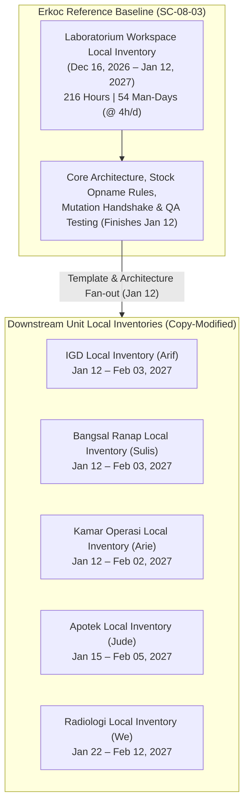

# Executive Summary: MyHosWeb System Implementation (Rev 7)
**Document Type:** Board of Directors Briefing  
**System:** MyHosWeb Integrated Hospital Information System (SIMRS)  
**MS Project File:** `workspace-task-rev-7-ms-project.mpp`  
**Operational Capacity Model:** **4 Hours / Day** (24 Hours/Week, Monday – Saturday)  
**Date of Report:** October 8, 2026  

---

## 1. Executive Snapshot & Strategic Overview

The **MyHosWeb System** is the digital enterprise backbone for modern hospital operations, unifying front office patient access, outpatient & inpatient care, emergency response, surgical suites, diagnostic laboratories & imaging (PACS), clinical pharmacy, supply chain logistics, hospital billing, and procurement.

**Revision 7 (`workspace-task-rev-7-ms-project.mpp`)** introduces a major **architectural standardization of Unit Local Inventory modules**. Under this revision, **Laboratorium Workspace Local Inventory (`SC-08-03`)** is designated as the **Canonical Reference Implementation**, built first by senior engineer **Erkoc**. All other unit local inventory modules across hospital departments consume and extend this reference baseline once its core design and testing phase completes on **January 12, 2027**.

| Key Metric | Value (4h/Day Model) | Rev-7 Variance vs Rev-6 | Strategic Executive Impact |
| :--- | :---: | :---: | :--- |
| **Daily Capacity Model** | **4 Hours / Day** | Stable | Part-time / focused allocation (24 hrs/wk, Mon–Sat) per engineer |
| **Net Engineering Effort** | **6,016 Person-Hours** | **+272 Hours (+4.7%)** | Equivalent to **1,504 Man-Days (@ 4h/day)** across 303 work packages |
| **Gross Work (MS Project Rollup)** | **12,024 Person-Hours** | +544 Hours | Standard rollup across 34 summary milestones & 303 work packages |
| **Operational Workspaces** | **34 Workspaces** | Stable | Covering 13 hospital clinical, diagnostic, and administrative departments |
| **Engineering Capacity** | **9 Domain Engineers** | Stable | 100% single-stream dedicated assignment with leveled workload |
| **Local Inventory Blueprint** | **Erkoc (`SC-08-03`)** | **Architectural Key** | Reference implementation finishes testing Jan 12, 2027; others copy-modify |
| **Final Delivery Due Date** | **February 12, 2027** | +3 Working Days | Final milestone (Radiology Local Inventory) reaches full staging readiness |

```mermaid
timeline
    title MyHosWeb Phased Delivery & Architectural Blueprint (Rev 7)
    section Wave 1 (Nov 2026) : Foundation & Front-End Access
        Week 4 (Nov 04 - 07) : Admisi Ranap : Tata Rekening : RM Berkas : Poli Tindakan : OK Scheduling
        Week 5 (Nov 10 - 16) : Gudang DO : Lab Order Entry : Apotek Antrian : Bangsal Bed Mgmt
        Week 6 (Nov 26 - 26) : Kasir Payment POS : Apotek Telaah Resep
    section Wave 2 (Dec 2026) : Clinical Workflows & Inventory Reference Build
        Week 7 (Dec 01 - 08) : Poli Inv : RM Casemix : Lab Results : IGD Triage : OK Mgmt : Gudang Inv
        Week 8 (Dec 15 - 24) : Kasir Closing Shift : Apotek Dispensing
        Week 9 (Dec 26 - 30) : RM Kemenkes RL (Rizal) : Gudang Retur (Roso)
    section Wave 3 (Jan - Feb 2027) : Reference Template Fan-out & Final Cutover
        Week 10 (Jan 01 - 12) : Radiologi Order : Purchasing PO : Apotek Serah Obat
        Week 10 (Jan 12) : Erkoc completes Lab Local Inv Testing (SC-08-03 Baseline Ready)
        Week 11 (Jan 15 - 21) : Erkoc WS Complete (Jan 15) : Radiologi PACS Expertise (Jan 21)
        Week 12 (Feb 02 - 05) : OK Inv (Feb 02) : IGD & Bangsal Inv (Feb 03) : Purchasing AP (Feb 03) : Apotek Inv (Feb 05)
        Week 13 (Feb 12) : Radiologi Local Inv (We finishes - Complete Hospital Cutover)
```

---

## 2. Strategic Rationale: Local Inventory Reference Blueprint

Revision 7 resolves cross-departmental schema fragmentation in unit inventory management:



1. **Standardized Reagent & Item Tracking**: Unit local inventories (IGD, Bangsal, OK, Apotek, Radiologi) require identical core patterns for stock opname, unit mutation requests, batch expiry tracking, and consumable usage logging.
2. **Single Point of Architecture Ownership**: By delegating `SC-08-03` to `Erkoc`, the core data contracts, microservice interfaces, and stock balance locks are built once and thoroughly tested before other engineers adapt them for their clinical domains.
3. **Controlled Schedule Extension**: The fan-out dependency adds only **3 working days** to the overall program schedule (shifting target completion from Feb 09 to **Feb 12, 2027**), while significantly improving code reusability and reducing defect rates during UAT.

---

## 3. Complete Workspace Due Date Schedule (All 34 Workspaces)

The table below lists all **34 operational workspaces**, ordered chronologically by **Due Date**, showing the assigned Person-in-Charge (PIC), technical effort, and man-days under the **4 hours/day model**:

| No | Module Code | Operational Workspace Name | Lead (PIC) | Effort (Hours) | Effort (Man-Days @ 4h/d) | Start Date | **Due Date (Completion)** |
| :-: | :---: | :--- | :---: | :---: | :---: | :---: | :---: |
| 1 | **SC-01-02** | Admisi Workspace Reg Rajal-IGD | Arif | 152 hrs | 38.0 days | 2026-09-20 | **2026-10-10** |
| 2 | **SC-01-01** | Admisi Workspace Booking | Arif | 144 hrs | 36.0 days | 2026-09-22 | **2026-10-12** |
| 3 | **SC-01-03** | Admisi Workspace Reg Ranap | Arif | 168 hrs | 42.0 days | 2026-10-12 | **2026-11-04** |
| 4 | **SC-02-01** | Tata Rekening Workspace Reg Out | Erkoc | 176 hrs | 44.0 days | 2026-10-12 | **2026-11-05** |
| 5 | **SC-04-01** | Rekam Medis Workspace Berkas RM | Rizal | 176 hrs | 44.0 days | 2026-10-12 | **2026-11-05** |
| 6 | **SC-05-01** | Poli Rawat Jalan Workspace Tindakan | Fikri | 192 hrs | 48.0 days | 2026-10-12 | **2026-11-07** |
| 7 | **SC-10-01** | Kamar Operasi Workspace Scheduling | Arie | 192 hrs | 48.0 days | 2026-10-12 | **2026-11-07** |
| 8 | **SC-12-01** | Gudang Workspace Terima Barang (DO) | Roso | 208 hrs | 52.0 days | 2026-10-12 | **2026-11-10** |
| 9 | **SC-08-01** | Laboratorium Workspace Order Laboratorium | We | 216 hrs | 54.0 days | 2026-10-12 | **2026-11-11** |
| 10 | **SC-11-01** | Apotek Workspace Antrian Apotek | Jude | 216 hrs | 54.0 days | 2026-10-12 | **2026-11-11** |
| 11 | **SC-06-01** | Bangsal Rawat Inap Workspace Bed Management | Sulis | 248 hrs | 62.0 days | 2026-10-12 | **2026-11-16** |
| 12 | **SC-03-01** | Kasir Workspace Kasir | Erkoc | 144 hrs | 36.0 days | 2026-11-06 | **2026-11-26** |
| 13 | **SC-11-02** | Apotek Workspace Telaah Resep | Jude | 136 hrs | 34.0 days | 2026-11-12 | **2026-12-01** |
| 14 | **SC-05-02** | Poli Rawat Jalan Workspace Local Inventory | Fikri | 168 hrs | 42.0 days | 2026-11-09 | **2026-12-02** |
| 15 | **SC-04-02** | Rekam Medis Workspace Casemix dan Coding | Rizal | 184 hrs | 46.0 days | 2026-11-06 | **2026-12-02** |
| 16 | **SC-08-02** | Laboratorium Workspace Result Management | We | 144 hrs | 36.0 days | 2026-11-12 | **2026-12-02** |
| 17 | **SC-07-01** | IGD Workspace IGD Triage | Arif | 232 hrs | 58.0 days | 2026-11-05 | **2026-12-08** |
| 18 | **SC-10-02** | Kamar Operasi Workspace Operative Management | Arie | 208 hrs | 52.0 days | 2026-11-09 | **2026-12-08** |
| 19 | **SC-12-02** | Gudang Workspace Local Inventory | Roso | 192 hrs | 48.0 days | 2026-11-11 | **2026-12-08** |
| 20 | **SC-03-02** | Kasir Workspace Closing Shift | Erkoc | 128 hrs | 32.0 days | 2026-11-27 | **2026-12-15** |
| 21 | **SC-11-03** | Apotek Workspace Dispensing | Jude | 160 hrs | 40.0 days | 2026-12-02 | **2026-12-24** |
| 22 | **SC-04-03** | Rekam Medis Workspace Pelaporan RL | Rizal | 168 hrs | 42.0 days | 2026-12-03 | **2026-12-26** |
| 23 | **SC-12-03** | Gudang Workspace Retur Beli | Roso | 152 hrs | 38.0 days | 2026-12-09 | **2026-12-30** |
| 24 | **SC-09-01** | Radiologi Workspace Order Radiologi | We | 208 hrs | 52.0 days | 2026-12-03 | **2027-01-01** |
| 25 | **SC-13-01** | Purchasing Workspace Purchase Order | Fikri | 264 hrs | 66.0 days | 2026-12-03 | **2027-01-09** |
| 26 | **SC-11-04** | Apotek Workspace Serah Obat | Jude | 144 hrs | 36.0 days | 2026-12-25 | **2027-01-14** |
| 27 | **SC-08-03** | Laboratorium Workspace Local Inventory | Erkoc | 216 hrs | 54.0 days | 2026-12-16 | **2027-01-15** *(Template Target)* |
| 28 | **SC-09-02** | Radiologi Workspace Expertise | We | 136 hrs | 34.0 days | 2027-01-02 | **2027-01-21** |
| 29 | **SC-10-03** | Kamar Operasi Workspace Local Inventory | Arie | 152 hrs | 38.0 days | 2027-01-12 | **2027-02-02** |
| 30 | **SC-05-02** | IGD Workspace Local Inventory | Arif | 160 hrs | 40.0 days | 2027-01-12 | **2027-02-03** |
| 31 | **SC-05-02** | Bangsal Rawat Inap Workspace Local Inventory | Sulis | 160 hrs | 40.0 days | 2027-01-12 | **2027-02-03** |
| 32 | **SC-13-02** | Purchasing Workspace Faktur Tagihan | Fikri | 168 hrs | 42.0 days | 2027-01-11 | **2027-02-03** |
| 33 | **SC-11-05** | Apotek Workspace Local Inventory | Jude | 152 hrs | 38.0 days | 2027-01-15 | **2027-02-05** |
| 34 | **SC-09-03** | Radiologi Workspace Local Inventory | We | 152 hrs | 38.0 days | 2027-01-22 | **2027-02-12** *(Final Cutover)* |
| **TOTAL** | | **All 34 Workspaces** | **9 Leads** | **6,016 hrs** | **1,504.0 days** | **2026-09-20** | **2027-02-12** |

---

## 4. Human Capital Allocation & Capacity Ranking (Rev 7)

Under the **4 hours/day model**, 1 man-day equals 4 productive engineering hours (24 hours/week). Workload across the 9 leads reflects the new template dependency:

| Rank | Resource Name | Assigned Hospital Workspaces | Leaf Tasks | Total Hours | **Man-Days (@ 4h/d)** | % Share | Projected Stream Finish |
| :---: | :--- | :--- | :---: | :---: | :---: | :---: | :---: |
| **1** | **Arif** | Front Office (Admisi & IGD) | 52 | **856.0 hrs** | **214.0 days** | 14.23% | Feb 03, 2027 |
| **2** | **We** | Diagnostics (Lab & Radiologi) | 43 | **856.0 hrs** | **214.0 days** | 14.23% | **Feb 12, 2027** *(Critical Path)* |
| **3** | **Jude** | Pharmacy & E-Prescription | 44 | **808.0 hrs** | **202.0 days** | 13.43% | Feb 05, 2027 |
| **4** | **Fikri** | Outpatient & Purchasing | 36 | **792.0 hrs** | **198.0 days** | 13.16% | Feb 03, 2027 |
| **5** | **Erkoc** | Cashier, Revenue & Lab Inv (Ref) | 31 | **664.0 hrs** | **166.0 days** | 11.04% | **Jan 15, 2027** *(Template Leader)* |
| **6** | **Arie** | Operating Theaters (OK) | 27 | **552.0 hrs** | **138.0 days** | 9.18% | Feb 02, 2027 |
| **7** | **Roso** | Warehouse & Logistics | 26 | **552.0 hrs** | **138.0 days** | 9.18% | Dec 30, 2026 |
| **8** | **Rizal** | Medical Records & Compliance | 23 | **528.0 hrs** | **132.0 days** | 8.78% | **Dec 26, 2026** *(First Done)* |
| **9** | **Sulis** | Inpatient & Bed Management | 21 | **408.0 hrs** | **102.0 days** | 6.78% | Feb 03, 2027 |
| **TOTAL** | | **Full Engineering Team** | **303** | **6,016.0 hrs** | **1,504.0 days** | **100.00%** | **Feb 12, 2027** |

---

## 5. Strategic Delivery Waves & Governance Gates (Rev 7)

The Board of Directors can evaluate progress against **3 Board Governance Gates**:

### Gate 1: Front Office, Outpatient & Financial Foundation (December 15, 2026)
* **Scope**: Admisi Booking & Registrasi, Rawat Jalan Consultation, Inpatient Bed Management, and Cashier Payment Point.
* **Success Criteria**: End-to-end digital patient encounter from kiosk check-in to bed assignment and preliminary billing without paper records.

### Gate 2: Perioperative, Supply Chain & Compliance (December 30, 2026)
* **Scope**: Emergency Triage (IGD), Operating Rooms (OK), Central Warehouse Logistics, and Medical Records (Kemenkes RL & Casemix).
* **Success Criteria**: Automated stock deductions on surgical consumption; zero discrepancies on test export of BPJS/Kemenkes ICD-10 data. `Rizal` completes all deliverables Dec 26.

### Gate 3: Reference Template Fan-out, Diagnostics & Full Cutover (February 12, 2027)
* **Scope**: Erkoc finishes Lab Local Inventory reference template testing on Jan 12. Downstream units (IGD, Bangsal, OK, Apotek, Radiologi) complete unit local inventory fan-out. Final PACS radiology cutover by `We` on Feb 12.
* **Success Criteria**: 100% test pass rate across all 34 workspaces; final production cutover sign-off.
